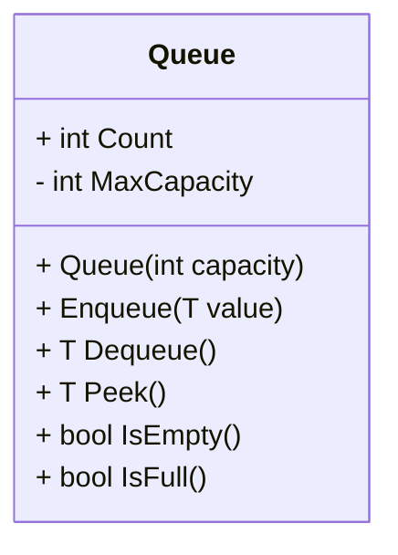

## Overview

Queue is a linear data structure that follows the FIFO (First In First Out) Principle. Queues are like a pipe with both ends open. Elements enters from one end and leaves from the other.



### Queue Operations



| Operation   | Description                                                                                     |
| ----------- | ----------------------------------------------------------------------------------------------- |
| **Enqueue** | Insert a new value at the end of the queue.                                                     |
| **Dequeue** | Select a value from the beginning of the queue.                                                 |
| **Peek**    | Checks the first item in the queue without removing it.                                         |
| **IsFull**  | Returns `true` when the queue is full, `false` otherwise.                                       |
| **IsEmpty** | Returns `true` when the queue is empty, `false` otherwise.                                      |
| **Count**   | Tracks the number of elements in the queue; increases with `Enqueue`, decreases with `Dequeue`. |

## Type of Queues

There are three common types of queues which cover a wide range of problems

- Linear Queue
- Circular Queue
- Priority Queue

### Linear Queue

- Linear data structure
- Adopts FIFO principle as a behavior (First Items inserted are the first ones to get processed)
- Can be represented by using an array, a linked list, or even a stack. That being said, an array is most commonly used because it’s the easiest way to implement Queues.

#### Applications

- Priority queues are used in operating systems -- especially for switching between processes.
- Store packets on routers in a certain order when a network is congested.
- Implementing a cache also relies heavily on queues
- Used to implement the Breadth First Search algorithm

**Tip:** Queues are used in the following scenarios

- We want to prioritize something over another (using a priority-queue)
- A resource is shared between multiple devices e.g., Printing Documents

#### Array-based Implementation

```csharp
public class LinearQueue<T>(int capacity) : IQueue<T>
{
 private readonly T[] _queue = new T[capacity];
 private readonly int capacity = capacity;
 private int _front = 0;
 private int _back = -1;

 public int Count { get; set; } = 0;
 public bool IsEmpty => Count == 0;
 public bool IsFull => Count == capacity;

 public T? Dequeue()
 {
  if (IsEmpty) return default;
  var @value = _queue[_front];
  _front = (_front + 1) % capacity;
  Count -= 1;
  return value;
 }

 public void Enqueue(T value)
 {
  if (IsFull) return;
  _back = (_back + 1) % capacity;
  Count += 1;
  _queue[_back] = value;
 }

 public T Peek()
 {
  return _queue[_front];
 }
}
```

### Circular Queue



Similar to Linear queues with one exception, circular queues are circular in the structure; this means that both ends are connected to form a circle. Initially the front and rear parts of the queue point to the same location and eventually move apart as more elements are inserted into the queue.

#### Applications

- **Circular Playlists/Media Queues**: Automatically cycles through items without needing to reset indices.
- **Resource Pooling**: Rotates limited resources (e.g., database connections) fairly.

#### Array-based Implementation

```csharp
public class CircularQueue<T>
{
    private T[] items;
    private int front;
    private int rear;
    private int count;
    private int capacity;
    public int Count => count;

    public CircularQueue(int size)
    {
        capacity = size;
        items = new T[capacity];
        front = 0;
        rear = -1;
        count = 0;
    }

    public void Enqueue(T item)
    {
        if (IsFull()) throw new InvalidOperationException("Queue is full.");
        rear = (rear + 1) % capacity;
        items[rear] = item;
        count++;
    }

    public T Dequeue()
    {
        if (IsEmpty()) throw new InvalidOperationException("Queue is empty.");
        T value = items[front];
        front = (front + 1) % capacity;
        count--;
        return value;
    }

    public T Peek()
    {
        if (IsEmpty()) throw new InvalidOperationException("Queue is empty.");
        return items[front];
    }

    public bool IsEmpty() => count == 0;
    public bool IsFull() => count == capacity;
}
```

### Priority Queues

In Priority Queues, elements are sorted in a specific order. Based on that order, **the most prioritized object appears at the front of the queue**, **the least prioritized object appears at the end, and so on**. These queues are widely used in an operating system to determine which programs should be given more priority.

#### Applications

- **Load Balancing**: Routes tasks with priority weights to available resources.
- **Event-Driven Simulations**: Events are executed in order of scheduled time.
- **Job Scheduling**: Printers, task managers, and systems dispatch high-priority jobs first.

#### Array-based Implementation

The ideal data structure for priority queues is the **Binary-heap**, but for the sake of illustration and simplicity, the following is an array based implementation.

> I'll elaborate more on the priority queue with binary heap implementation later on!

```csharp
public class PriorityQueue<T>
{
    private struct Node { public T Value; public int Priority; }
    private Node[] items;
    private int count;

    public PriorityQueue(int capacity)
    {
        items = new Node[capacity];
        count = 0;
    }

    public void Enqueue(T value, int priority)
    {
        if (count == items.Length)
            throw new InvalidOperationException("Priority queue is full.");
        items[count++] = new Node { Value = value, Priority = priority };
    }

    public T Dequeue()
    {
        if (IsEmpty())
            throw new InvalidOperationException("Priority queue is empty.");

        int bestIndex = 0;
        for (int i = 1; i < count; i++) // Assuming that low-priority numbers are higher in priority e.g. 1 > 5.
            if (items[i].Priority < items[bestIndex].Priority)
                bestIndex = i;

        // Re-arranging the queue
        T bestValue = items[bestIndex].Value;
        for (int i = bestIndex; i < count - 1; i++)
            items[i] = items[i + 1];
        count--;
        return bestValue;
    }

    public T Peek()
    {
        if (IsEmpty())
            throw new InvalidOperationException("Priority queue is empty.");
        int bestIndex = 0;
        for (int i = 1; i < count; i++)
            if (items[i].Priority < items[bestIndex].Priority)
                bestIndex = i;
        return items[bestIndex].Value;
    }

    public bool IsEmpty() => count == 0;
    public int Count => count;
}
```
