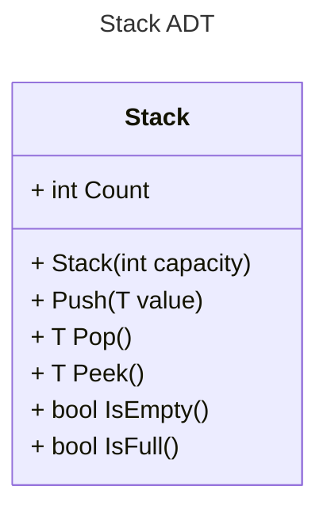

## Overview

Stack is a linear data structure that follows the First In Last Out (FILO) Principle. Can be either implemented using arrays or linked lists, with each has it's own privileges.

The most common implementation of stacks relies more on arrays since it consumes lower space as we don't define any extra pointers like we have in linked lists.



### **Array Vs. Linked List Implementation**

Stacks that are implemented with arrays has predefined fixed size that's stored in a Consecutive manner and that's due to the fact that arrays are pre-allocated while linked lists can expand (limited to the available memory boundaries) in random memory locations.

## Stack Operations



| Operation   | Description                                                                                                                                                          |
| ----------- | -------------------------------------------------------------------------------------------------------------------------------------------------------------------- |
| **Push**    | Insert a value on the top of the stack.                                                                                                                              |
| **Pop**     | Retrieves the value from the top of the stack and removes it.                                                                                                        |
| **Peek**    | Retrieves the value at the top of the stack **without** removing it.                                                                                                 |
| **IsEmpty** | Returns a Boolean that indicates whether the stack contains any values.                                                                                              |
| **IsFull**  | Returns a Boolean that indicates whether the stack has reached its full capacity. _(Not applicable for dynamic stacks such as those implemented with linked lists.)_ |

### Time Complexity

| Operation | Time Complexity |
| --------- | --------------- |
| _isEmpty_ | $O(1)$          |
| _top_     | $O(1)$          |
| _size_    | $O(1)$          |
| _push_    | $O(1)$          |
| _pop_     | $O(1)$          |

### Applications

- Backtracking the previous task/state, For example, back and forward in File explorers and Internet Browsers **or in a recursive code**.
- Used in many algorithms like Depth First Search and Expression Evaluation Algorithm
- To store partially completed tasks, e.g., when you are exploring two different paths on a Graph from a point while calculating the smallest path to the target.

## Array Implementation

```csharp
public class Stack<T>
{
    private T[] items;
    private int top;
    private int capacity;

    public Stack(int size)
    {
        capacity = size;
        items = new T[capacity];
        top = -1;
    }

    public void Push(T item)
    {
        if (IsFull())
            throw new InvalidOperationException("Stack is full.");
        items[++top] = item;
    }

    public T Pop()
    {
        if (IsEmpty())
            throw new InvalidOperationException("Stack is empty.");
        return items[top--];
    }

    public T Peek()
    {
        if (IsEmpty())
            throw new InvalidOperationException("Stack is empty.");
        return items[top];
    }

    public bool IsEmpty()
    {
        return top == -1;
    }

    public bool IsFull()
    {
        return top == capacity - 1;
    }
}
```
