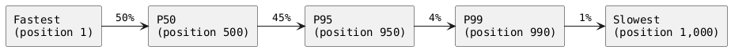
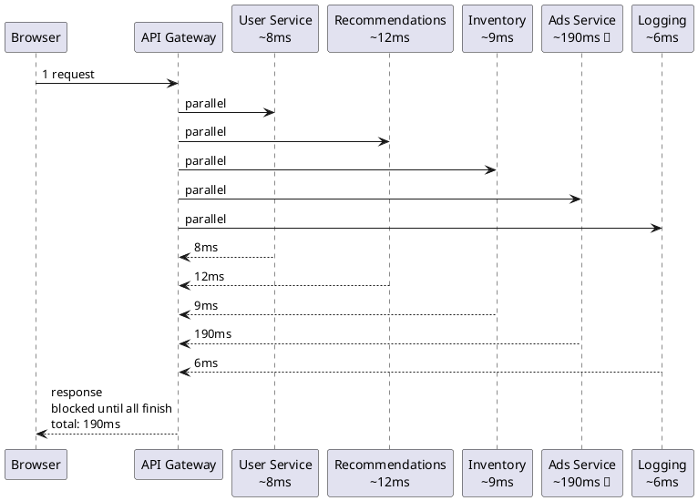
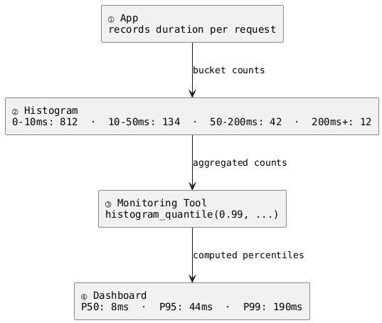

For most of computing history, the answer to "how fast is our system?" was a single number: the average response time. It was easy to calculate, easy to put on a dashboard, and easy to report to stakeholders. There was just one problem - it kept lying.

Teams would look at a perfectly healthy average and miss the fact that a meaningful slice of their users were waiting ten times longer than everyone else. The average didn't hide this maliciously. It just wasn't designed for the question being asked.

Percentiles were the answer. They were borrowed from statistics - where they'd been used for decades in medicine, education, and economics to describe how individuals rank within a group - and applied to system performance monitoring as web-scale software made the limits of the average impossible to ignore.[^1]

> **Key Takeaways**
>
> - The average smooths over slow outliers, making a system look healthier than it is.
> - Percentiles rank your measurements - P50 is the middle, P95 and P99 are the slow end.
> - P50 tells you what the typical user experiences. P99 tells you what the unlucky ones wait for.
> - A wide gap between P50 and P99 usually means something is causing unpredictable slowdowns - not consistently slow, but randomly slow.
> - Optimizing for the average often leaves the worst experiences untouched. P99 is the more honest target.

## Where the Average Breaks Down

Before getting into percentiles, it helps to understand exactly why the average fails - because the failure isn't obvious until you see it spelled out.

Imagine a coffee shop. On a typical morning they serve 100 customers. Ninety-five of them get their coffee in 2 minutes. Five customers hit a bad moment - the machine jammed, the barista had to switch cups - and waited 22 minutes each.

Average wait time:

$$\frac{95 \times 2 + 5 \times 22}{100} = 3 \text{ minutes}$$

Three minutes sounds reasonable. But five real people had a genuinely bad experience, and the average gave you no indication that anything was wrong. Now scale that coffee shop to a web server handling 100,000 requests per hour. The "five bad experiences" becomes 5,000 users per hour having a terrible time, all invisible behind a number that looks fine.

This is the core problem. The average adds everything together and divides. It cannot distinguish between "everyone had a consistent experience" and "most people were fine but a few were miserable." Those two situations are completely different in practice - they have different causes, different fixes, and different impacts on users - but the average reports the same number.

## What a Percentile Actually Is

A percentile is a ranking tool. It answers one specific question: **what value do X% of your measurements fall below?**

Start with a concrete picture. Imagine collecting 1,000 response time measurements from your server over five minutes, then lining them up from fastest to slowest:


- **P50** is the measurement at position 500 - right in the middle. Half the requests were faster, half were slower.
- **P95** is the measurement at position 950. 95% of requests were faster than this.
- **P99** is the measurement at position 990. 99% of requests were faster than this.

No formula. No black box. Just sorting and reading specific positions. The reason these positions matter is that each one tells you about a different group of users.

## The Four Numbers

### Average (Mean)

The average is the sum of all measurements divided by the count. It's useful for understanding the total resource cost of your system - how much work the server is doing on average - but it's a poor indicator of what any individual user experiences.

Its weakness: a small number of very slow requests can move the average noticeably, but when that number is small enough, the movement is invisible.

989 requests at 10 ms, 11 requests at 1,000 ms:

$$\frac{989 \times 10 + 11 \times 1{,}000}{1{,}000} = 20.9\,\text{ms}$$

20.9ms reads as completely healthy. But 1.1% of users — 11 out of every 1,000 requests — waited 100× longer than everyone else. The average absorbed the spike without raising any alarm.

**The same dataset, four different answers:**

```vegalite
{
  "$schema": "https://vega.github.io/schema/vega-lite/v5.json",
  "title": "AVG vs P50 vs P95 vs P99 — same 1,000 requests",
  "width": 400,
  "height": 250,
  "data": {
    "values": [
      {"metric": "Average", "ms": 20.9},
      {"metric": "P50",     "ms": 10},
      {"metric": "P95",     "ms": 10},
      {"metric": "P99",     "ms": 1000}
    ]
  },
  "layer": [
    {
      "mark": "bar",
      "encoding": {
        "x": {
          "field": "metric",
          "type": "ordinal",
          "sort": ["Average", "P50", "P95", "P99"],
          "axis": {"title": ""}
        },
        "y": {
          "field": "ms",
          "type": "quantitative",
          "axis": {"title": "Response time (ms)"}
        }
      }
    },
    {
      "mark": {"type": "text", "dy": -6},
      "encoding": {
        "x": {
          "field": "metric",
          "type": "ordinal",
          "sort": ["Average", "P50", "P95", "P99"]
        },
        "y": {
          "field": "ms",
          "type": "quantitative"
        },
        "text": {"field": "ms", "type": "quantitative"}
      }
    }
  ]
}
```

All four numbers describe the exact same dataset. Average, P50, and P95 all sit between 10–21ms — nothing looks wrong. Then P99 jumps to 1,000ms. That jump is what the average, P50, and P95 were all hiding.

### P50 - The Typical Experience

P50 is just the median with a different name. It's the response time that exactly half your requests beat.

This is the most honest answer to "what does a normal user experience?" Because it's based on position rather than arithmetic, extreme outliers can't distort it. If your P50 is 12ms, the majority of your users are getting roughly 12ms, full stop - regardless of how bad the worst 1% is.

P50 is your baseline. It describes normal. When P50 starts rising, your typical behavior is getting worse. Two systems can share an identical P50 while one of them has a P99 ten times higher — P50 alone tells you nothing about the slow end.


### P95 - The Unlucky Minority

P95 is the response time that 5% of requests exceed. It captures users who hit your system at a bad moment - during a spike in traffic, when a background job is running, when the database is under load.

Here's what makes P95 important: at any meaningful scale, 5% is not a rounding error. At **1,000 requests per second**, you generate 50 P95-level experiences every single second. Those are real users, and they're hitting your system right now, not occasionally.

P95 is often where SLAs (service-level agreements) are defined. "99% of requests under 200ms" is a P99 commitment. "95% of requests under 100ms" is a P95 commitment. These numbers exist because the companies writing them knew an average target was meaningless.

{: .important }
**How P95 actually reads:** If your P95 is 80ms, it means 95% of requests completed in 80ms or less - and 5% took longer than 80ms. A common mistake is reading "P95 = 80ms" as "most requests are 80ms." They aren't - 95% are faster. The P95 value is the ceiling for the fast majority, not a description of typical behavior.

### P99 - The Worst Realistic Experience

P99 is the response time that 1% of requests exceed. If P50 tells you about the normal experience and P95 tells you about the unlucky minority, P99 tells you about the worst realistic case - requests that hit every bad condition at once.

At **10,000 requests per second**, P99 happens 100 times per second. Those users exist. They're waiting. And your average won't tell you anything about what they're going through.

P99 is where the hard-to-reproduce bugs live. Cold caches, garbage collection pauses, slow network routes, lock contention on a shared resource - these don't happen on every request, but they happen regularly enough to show up at the 99th percentile. A high P99 usually means your system has unpredictable behavior on some slice of requests, and that slice is worth finding.

{: .important }
**How P99 actually reads:** If your P99 is 400ms, it means 99% of requests completed in 400ms or less - and 1% took longer than 400ms. The most common mistake is saying "it's only 1%" and ignoring it. The second most common mistake is confusing P99 with "the 99th request" - it describes a latency threshold, not a specific numbered request.

At extreme scale, the tail goes further. **P999** (the 0.1% tail) and **P9999** (the 0.01% tail) exist and are tracked by companies operating at 100,000+ RPS — at that volume, P999 still happens 100 times per second and P9999 happens 10 times per second. The response times at those thresholds are often an order of magnitude higher than P99, driven by the rarest conditions: cold JIT compilation, OS scheduling jitter, or a single slow network hop that affects one connection in ten thousand. For most systems, P99 is the right stopping point. When you're operating at a scale where "one in a thousand" is a hundred events per second, you keep going.

## Why the Industry Moved to Percentiles

The shift from average-based to percentile-based monitoring happened gradually through the 2000s and accelerated with the growth of web-scale systems at companies like Amazon and Google.

The turning point was recognizing that at large scale, tail latency - the slow end of the distribution - stops being an edge case and starts being a daily operational reality. In 2013, Google engineers Jeffrey Dean and Luiz André Barroso published a paper called [The Tail at Scale](https://research.google/pubs/the-tail-at-scale/) that made this concrete: in a system where a single user request fans out across hundreds of backend services, the probability that at least one of those services returns a slow response approaches certainty.[^2]

{: .note }
**What fan-out means:** When you open a page on a large platform, your browser sends one request - but behind the scenes, that request might trigger calls to a user service, a recommendations service, an inventory service, an ads service, and a logging service, all happening in parallel. That's fan-out: one inbound request "fans out" into many downstream calls. The page can't load until all of them finish, so the slowest one sets the floor for the entire user experience. The more services involved, the higher the chance that at least one of them has a bad moment.



This meant optimizing the average was optimizing the wrong thing. The slow outliers - the requests that became the P99 - were the ones actually shaping user experience at scale. Percentiles gave teams a language for talking about and measuring those outliers directly.

## Reading Them Together

The real insight comes from comparing the numbers, not reading any one of them in isolation.

| What you observe | What it likely means |
| :--- | :--- |
| P50 = 12ms, P99 = 15ms | Tight gap - consistent behavior, the system responds predictably regardless of conditions |
| P50 = 12ms, P99 = 800ms | Wide gap - something is causing occasional severe slowdowns: GC pauses, cache misses, lock contention |
| P50 = 200ms, P99 = 210ms | Consistently slow but predictable - the bottleneck is structural (a slow query, a synchronous call) not random |
| P50 rising, P99 stable | Typical behavior is degrading - increased load or a gradual regression in the common path |
| P99 rising, P50 stable | Outliers are getting worse while the common case stays fine - something is randomly spiking |

The gap between P50 and P99 is often the most informative single signal. A tight gap means the system is stable. A wide gap means something is introducing variance, and variance is what makes a system feel unreliable even when the average says otherwise.

In practice, the P50-to-P99 gap is where regressions often surface first. A deployment that looks clean on average dashboards can show up as a quietly widening gap a day later — noticeable only once you're watching the right number.

Knowing what to look for is the first step. Making those numbers visible in your system is the second — and in most modern stacks, that's already handled for you.

## Are These Numbers Given, or Do You Have to Set Them Up?

**In modern monitoring tools, percentiles are built in - but only if you're feeding them the right kind of data.** Tools like Prometheus, Datadog, Grafana, New Relic, and Azure Monitor can all compute P50, P95, and P99 out of the box. What they need from your application is not raw logs, but **metrics** - specifically a type of metric called a histogram.[^3]

A histogram works by recording every measurement into pre-defined buckets (0-10ms, 10-50ms, 50-200ms, and so on) and counting how many requests land in each. The monitoring tool uses those counts to estimate percentiles without storing every individual data point. This is efficient enough to run in production at high traffic.



In .NET, **ASP.NET Core automatically records request duration as a histogram** - this existed earlier via `EventCounters`, but in .NET 8 it was overhauled to use the `System.Diagnostics.Metrics` API and aligned with OpenTelemetry conventions under the metric name `http.server.request.duration`.[^4] If you're on .NET 8+ and exporting metrics to Prometheus or Azure Monitor, you get percentiles without writing a single extra line of code.

For custom operations - a specific method, a database call, a third-party API - you record the duration yourself:

```csharp
// Record a custom measurement - the monitoring tool handles the percentile math
private static readonly Histogram<double> _checkoutDuration =
    Meter.CreateHistogram<double>("checkout.duration", unit: "ms");

var sw = Stopwatch.StartNew();
await ProcessCheckoutAsync(order);
_checkoutDuration.Record(sw.Elapsed.TotalMilliseconds);
```

**What about logs?** You can calculate percentiles from logs, and some teams do. The downside is cost and latency: logs at high traffic volumes are expensive to store and query, and log-based percentile queries are slow. Logs are better suited for understanding *why* a specific slow request happened, not for tracking the P99 trend over time.

**What about traces?** Distributed tracing (via OpenTelemetry, Jaeger, or similar) gives you a detailed picture of what happened inside a single request. It's the right tool for diagnosing a spike once you've spotted it - not for measuring the spike in the first place. Percentiles come from aggregating across thousands of requests; traces show you one at a time.

| Data source | Good for percentiles? | Best used for |
| :--- | :--- | :--- |
| **Metrics (histograms)** | Yes - designed for this | Dashboards, alerts, SLO tracking |
| **Logs** | Possible, but expensive | Debugging specific slow requests |
| **Traces** | No - single-request view | Root cause analysis after a spike |

{: .tip }
If you're starting from scratch, the path of least resistance in .NET is: enable OpenTelemetry, export to your monitoring tool of choice, and use the built-in ASP.NET Core request duration histogram. You'll have P50/P95/P99 on a dashboard without custom instrumentation.

## Where to Start When Something Looks Wrong

**P99 is high?** Something is causing spikes - it happens rarely but badly when it does. Look for things that don't happen on every request: cache misses, garbage collection, slow external calls, locks. [Hot paths](/posts/hot-path/) are the most common source — code that runs on every request, where small repeated inefficiencies compound into exactly the kind of tail spikes P99 reveals.

**P99 is fine but P50 is slow?** The problem is consistent, not random. Something slow is on every request's path: a database query that always takes 80ms, a synchronous call that blocks every time, middleware that does unnecessary work on each request.

**Both look fine but the average is high?** You likely have a very small number of extreme outliers - requests taking seconds rather than milliseconds. These may be bugs, timeouts, or edge cases in rarely-used code paths. Worth investigating, but less urgent than the above.

The average is the last number to act on, not the first. Fixing it directly often means optimizing the cases that are already fast while ignoring the ones that need attention.

Start with P99. It's the number that works hardest to stay invisible — and in our experience, the one that most reliably predicts what users are about to complain about before any support ticket is filed.

[^1]: Schwartz, B. et al. (2012). *High Performance MySQL*, 3rd ed. O'Reilly. The use of percentiles for latency measurement in server systems is traced there as a natural evolution from statistical process control methods developed in manufacturing QA during the 1950s–70s.
[^2]: Dean, J., & Barroso, L. A. (2013). The tail at scale. *Communications of the ACM*, 56(2), 74–80. <https://dl.acm.org/doi/10.1145/2408776.2408794>
[^3]: Prometheus documentation — Histogram metric type. <https://prometheus.io/docs/concepts/metric_types/#histogram>
[^4]: Microsoft — ASP.NET Core metrics, `http.server.request.duration`. <https://learn.microsoft.com/aspnet/core/log-mon/metrics/metrics>
