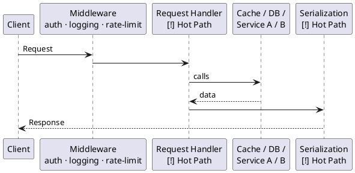
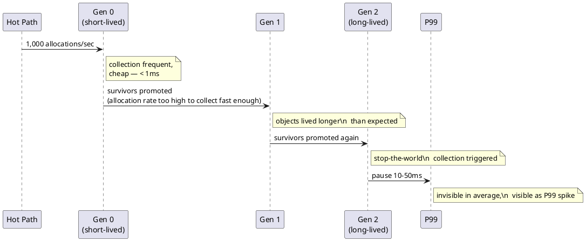
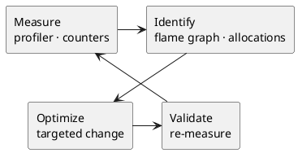
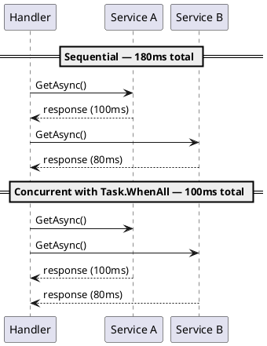
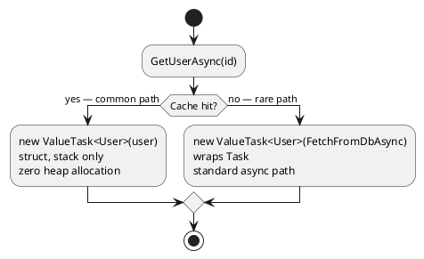

> **Key Takeaways**
>
> - Profiling first is non-negotiable. Optimizing code you haven't measured produces guesswork, not improvements.
> - The three most damaging patterns on hot paths: unnecessary per-request allocations, sequential I/O that could run concurrently, and recreating objects that could be shared.
> - Start with `Task<T>` for async methods. Switch to `ValueTask<T>` only when profiling confirms allocation pressure on a frequently-synchronous path.
> - Keep the hot path short, free of recomputed work, and clear of shared mutable state under concurrent access.

Performance problems rarely come from a single operation doing too much. They come from code running frequently enough that any small inefficiency compounds into something users actually feel. A **hot path** is any sequence of code that either runs very often - thousands of times per second under normal load - or sits directly on the critical execution path of a request, where its latency becomes your latency. In both cases, the same principle applies: costs that look harmless in isolation become visible when repeated at scale.

A method called once per minute can afford to be slow. A method called on every incoming request at 1,000 RPS (requests per second) cannot. The math is unforgiving, and so is the latency distribution.

The request lifecycle below shows where hot paths typically live - request handlers, shared middleware, and serialization loops that execute on every request without exception:

**Where hot paths appear in a typical request lifecycle:**



Hot paths aren't limited to the handler itself. Any code that runs on every request - serialization, response formatting, authentication middleware - qualifies if it's doing more work than it needs to.

## Why Small Inefficiencies on Hot Paths Add Up

A single extra allocation per request at 1,000 RPS means 1,000 short-lived objects landing on the heap every second. The [garbage collector](https://learn.microsoft.com/dotnet/standard/garbage-collection/fundamentals) has to clean those up.[^1] At a high enough rate, GC pauses become frequent enough to start affecting response times - specifically the p95 and p99 [percentiles](/posts/p50-p95-p99-average-latency/), which represent the slowest 5% and 1% of requests.

Those slow-tail responses are what users at the unlucky end actually experience. Cutting the median response time from 20ms to 15ms often goes unnoticed. Cutting the p99 from 400ms to 50ms almost always doesn't. Hot paths drive three categories of cost that grow with traffic:

| Cost category | What causes it | What you observe |
| :--- | :--- | :--- |
| **Allocation pressure** | Short-lived objects created per-call | Rising GC/sec, allocation rate in MB/s |
| **CPU overhead** | Repeated work that could be cached or skipped | High CPU utilization, slow throughput |
| **Thread pool strain** | Blocking calls disguised as async | Thread pool starvation, climbing queue depth |

Gen 2 garbage collections in .NET involve stop-the-world pauses. On a path called ten thousand times per second, even a few unnecessary allocations per call show up as milliseconds of wall-clock impact at the system level.

**How per-request allocations travel up the GC generations and surface as P99 spikes:**



## How Do You Find a Hot Path?

The starting position is always the same: measure before you touch anything. An optimization based on intuition that isn't confirmed by measurement is indistinguishable from noise - and often increases code complexity without improving the performance profile. In the majority of cases where a team was convinced they knew the hot path before profiling, the profiler pointed somewhere else.

**The cycle that turns profiling sessions into real improvements:**



Each pass should be narrow - one change, one validation. Making several optimizations at once makes it impossible to know which one moved the needle.

### Profilers: Seeing Where Time Goes

Three tools cover most .NET profiling scenarios:

| Tool | Best for | Output |
| :--- | :--- | :--- |
| [dotnet-trace](https://learn.microsoft.com/dotnet/core/diagnostics/dotnet-trace) | Production-safe CPU sampling, allocation tracking | `.nettrace` file, viewable in PerfView or VS |
| [PerfView](https://github.com/microsoft/perfview) | Deep GC analysis, flame graphs, event traces | Flame graphs, GC heap views, allocation stacks |
| [Visual Studio Profiler](https://learn.microsoft.com/visualstudio/profiling/?view=vs-2022) | Integrated development-time profiling | CPU Usage, .NET Object Allocation, Instrumentation |

[Flame graphs](http://www.brendangregg.com/flamegraphs.html) are the most effective visualization for spotting hot paths quickly.[^2] Width represents CPU time: a wide bar near the top of the call stack means that function, or something it calls, is consuming a large fraction of total CPU. Those are the candidates worth investigating.

**Schematic flame graph — the wide bar is where the time actually goes:**

```vegalite
{
  "$schema": "https://vega.github.io/schema/vega-lite/v5.json",
  "title": "Schematic flame graph — width = % of total CPU time",
  "width": 500,
  "height": 180,
  "data": {
    "values": [
      {"depth": 1, "label": "HandleRequest",                             "x1": 0,  "x2": 100, "hot": false},
      {"depth": 2, "label": "Auth",                                       "x1": 0,  "x2": 6,   "hot": false},
      {"depth": 2, "label": "ProcessRequest (82%)",                       "x1": 6,  "x2": 88,  "hot": false},
      {"depth": 2, "label": "Serialize",                                  "x1": 88, "x2": 100, "hot": false},
      {"depth": 3, "label": "Validate",                                   "x1": 6,  "x2": 14,  "hot": false},
      {"depth": 3, "label": "BuildUserContext  ◄ HOT  70% CPU",          "x1": 14, "x2": 84,  "hot": true},
      {"depth": 3, "label": "Log",                                        "x1": 84, "x2": 88,  "hot": false},
      {"depth": 4, "label": "new UserContext() — allocates on every call", "x1": 14, "x2": 84,  "hot": true}
    ]
  },
  "layer": [
    {
      "mark": {"type": "bar", "stroke": "white", "strokeWidth": 1},
      "encoding": {
        "y": {
          "field": "depth", "type": "ordinal", "sort": "ascending",
          "axis": {"title": "call stack", "labels": false, "ticks": false}
        },
        "x": {
          "field": "x1", "type": "quantitative",
          "scale": {"domain": [0, 100]},
          "axis": {"title": "% CPU time", "grid": false}
        },
        "x2": {"field": "x2"},
        "color": {
          "field": "hot", "type": "nominal",
          "scale": {"domain": [false, true], "range": ["#93c5fd", "#1e3a5f"]},
          "legend": null
        }
      }
    },
    {
      "mark": {"type": "text", "align": "left", "baseline": "middle", "dx": 4, "fontSize": 10, "clip": true},
      "encoding": {
        "y": {"field": "depth", "type": "ordinal", "sort": "ascending"},
        "x": {"field": "x1", "type": "quantitative"},
        "text": {"field": "label"},
        "color": {
          "field": "hot", "type": "nominal",
          "scale": {"domain": [false, true], "range": ["#1e3a5f", "#ffffff"]},
          "legend": null
        }
      }
    }
  ]
}
```

For isolated functions where you want precise nanosecond measurements without system noise, [BenchmarkDotNet](https://benchmarkdotnet.org/) is the right tool.[^3] It handles warmup iterations, multiple runs, and statistical analysis automatically.

### Counters: Watching Live Behavior

Profilers tell you where time went in a recorded session. Counters tell you what the system is doing *right now*, while it's under real load. The two tools complement each other: counters surface the signal, profilers explain it.

The .NET runtime exports live performance counters you can stream to the terminal with a single command:

```bash
dotnet-counters monitor --process-id <pid> --counters System.Runtime
```

You don't need to restart the app, attach a debugger, or change any code. Run this while sending load, then watch four numbers:

| Counter | What it measures | Healthy | Alarming |
| :--- | :--- | :--- | :--- |
| `gen-2-gc-count` | How often the GC runs a full (stop-the-world) collection | Near 0 per minute | Rising steadily under load — means short-lived objects are surviving long enough to promote to Gen 2 |
| `alloc-rate` | Heap allocation in MB/sec | Stable or low | Sharp climb under load — a hot path is creating objects faster than the GC can clear them |
| `threadpool-queue-length` | Tasks waiting for a thread-pool thread | Near 0 | Growing queue — a blocking call somewhere is tying up threads that should be free |
| `exception-count` | Exceptions thrown per second | Near 0 | Any sustained rate — exceptions on a hot path are expensive; each one captures a stack trace |

What you're looking for isn't a single bad value — it's a value that *moves when load increases*. A `gen-2-gc-count` of 2 while idle is fine. A `gen-2-gc-count` that climbs from 2 to 40 as you ramp traffic is the hot path telling you it's creating too much garbage.

{: .note }
`p95` / `p99` latency don't appear in `dotnet-counters` — they're computed by your monitoring tool (Prometheus, Datadog, Azure Monitor) from histogram data. A climbing P99 while your counters look stable usually means the problem is external: a slow downstream service, a database query, or a network timeout.

As a practical starting point: if a single method accounts for roughly 10% or more of CPU time or heap allocations in a flame graph, treat it as a hot path candidate worth investigating. The exact threshold matters less than the habit — the goal is to focus attention on code that will actually move the meter, not code that feels suspicious.

{: .important }
If you haven't measured it, it isn't a hot path. It's a guess.

## What to Fix: The Three Most Common Patterns

### Reuse What Doesn't Change Between Calls

The quickest wins usually come from objects being recreated on every request for no real reason. Many classes in .NET are designed to be created once and shared - but end up constructed fresh per call out of habit.

The two most common culprits in ASP.NET Core:

**`HttpClient`**: Creating a new `HttpClient` per request wastes sockets and can exhaust the connection pool under load. Use [`IHttpClientFactory`](https://learn.microsoft.com/aspnet/core/fundamentals/http-requests?view=aspnetcore-8.0) instead, which manages pooled `HttpMessageHandler` instances with proper lifetime management.

**`JsonSerializerOptions`**: Constructing a new `JsonSerializerOptions` on every serialization call pays a reflection cost each time. Create a single static instance and reuse it:

```csharp
// Creates and configures JsonSerializerOptions on every request
public IActionResult Get()
{
    var options = new JsonSerializerOptions { PropertyNamingPolicy = JsonNamingPolicy.CamelCase };
    return Results.Json(GetData(), options);
}

// Pays the configuration cost once, reuses the instance on every request
private static readonly JsonSerializerOptions JsonOpts = new()
{
    PropertyNamingPolicy = JsonNamingPolicy.CamelCase
};

public IActionResult Get() => Results.Json(GetData(), JsonOpts);
```

The same principle applies to compiled `Regex` instances (use `[GeneratedRegex]` in .NET 7+ or a static cached instance), `StringBuilder` pools available via `ArrayPool<T>`, and any configuration object that's expensive to construct but cheap to read.

### Run I/O Concurrently, Not Sequentially

Sequential I/O is one of the most damaging patterns on a hot path because its cost is strictly additive. Waiting 100ms for service A and then 80ms for service B produces 180ms total when both could have completed in 100ms.

**Sequential vs. concurrent service calls - the time difference:**



The fix is to start all tasks before awaiting any of them:

```csharp
// Sequential: each await blocks the next call from starting
var json1 = await http.GetStringAsync(Svc1);
var json2 = await http.GetStringAsync(Svc2);
// Total wait: ~180ms

// Concurrent: both calls start immediately, we await both together
var t1 = http.GetStringAsync(Svc1);
var t2 = http.GetStringAsync(Svc2);
var (json1, json2) = (await t1, await t2);
// Total wait: ~100ms
```

`Task.WhenAll` is the natural choice when composing a variable number of tasks or when you want to be explicit about concurrent intent:

```csharp
// Inject http via IHttpClientFactory - never instantiate HttpClient directly
public async Task<IActionResult> Get(HttpClient http)
{
    var t1 = http.GetStringAsync(Svc1);
    var t2 = http.GetStringAsync(Svc2);
    var results = await Task.WhenAll(t1, t2);

    var a = JsonSerializer.Deserialize<A>(results[0], JsonOpts);
    var b = JsonSerializer.Deserialize<B>(results[1], JsonOpts);
    return Results.Json(Combine(a, b), JsonOpts);
}
```

{: .tip }
`Task.Run` is for CPU-bound work that needs to move off the UI or request thread. Don't wrap true async I/O inside `Task.Run` - you'll hold a thread-pool thread idle while the kernel handles the I/O. See [Async vs. Parallel in C#](/series/async-await/async-vs-parallel-csharp/) for when each tool applies.

### Reduce Allocations With `ValueTask` on Synchronous-Dominant Paths

`Task<T>` is the right default for async methods. It's straightforward, composes cleanly with the rest of the async ecosystem, and carries no usage restrictions. But on hot paths where a method frequently completes synchronously - cache lookups are the canonical example, where the answer is already in memory on a hit - every `Task<T>` return allocates an object on the heap.

#### Why `Task<T>` Allocates at All

When you `return Task.FromResult(user)`, the runtime constructs a `Task<User>` object on the heap even though no actual asynchronous work happened. The calling code awaits it, the scheduler sees it's already completed, and the object gets discarded. At 1,000 RPS with a 90% cache hit rate, that's 900 `Task<User>` objects per second created solely to be immediately collected. Each one is small — around 56 bytes — but the GC still has to discover and reclaim them. Over time, that pressure contributes to Gen 0 collection frequency and, at high enough rates, starts surfacing in your P99.

#### How `ValueTask<T>` Fixes It

`ValueTask<T>` is a struct, not a class. When a method returns `new ValueTask<User>(user)` on the synchronous path, the result lives on the stack — no heap allocation, no GC involvement.[^4] Only when the method genuinely suspends (a cache miss that goes to the database) does it behave like a regular `Task<T>`:

```csharp
// Task<T>: allocates a Task object on every call, including cache hits
public Task<User> GetUserAsync(string id)
    => cache.TryGet(id, out var user)
       ? Task.FromResult(user)       // heap allocation even though we have the answer
       : FetchFromDbAsync(id);

// ValueTask<T>: no heap allocation when the result is immediately available
public ValueTask<User> GetUserAsync(string id)
    => cache.TryGet(id, out var user)
       ? new ValueTask<User>(user)              // struct on the stack, zero allocation
       : new ValueTask<User>(FetchFromDbAsync(id)); // wraps the Task on the async path
```

The caller's code doesn't change — `await GetUserAsync(id)` works identically either way. The difference is entirely in what happens at the memory level on the hot path.

#### When the Numbers Actually Move

The allocation savings only compound when two conditions are both true:

1. **The synchronous path runs far more often** — if the cache miss rate is 50%, you're allocating half the time anyway. `ValueTask` only eliminates the cost on the synchronous half, so the improvement is proportional to how often you actually take that path.
2. **The method is called at high frequency** — a rare operation called a few times a second won't show in a profiler regardless of which type you use. The payoff is real only at thousands of calls per second.



At a 90% hit rate and 5,000 RPS, switching from `Task.FromResult` to `ValueTask` eliminates roughly 4,500 short-lived heap objects per second. Whether that has a measurable effect on your P99 depends on your baseline GC pressure — which is exactly why you measure first.

#### The Constraints You Cannot Ignore

`ValueTask<T>` has rules that `Task<T>` doesn't. Violating them produces silent data corruption or deadlocks, not compiler errors:

| Rule | Why it exists |
| :--- | :--- |
| **Await only once** | A `ValueTask` may be backed by a pooled object that gets recycled after the first await. Awaiting again reads recycled memory. |
| **Don't `.Result` or `.GetAwaiter().GetResult()` block on it** | Blocking on a `ValueTask` that wraps a pooled `IValueTaskSource` can deadlock if the source requires the current thread to complete. |
| **Don't store it in a field for later** | The backing object may already be returned to the pool by the time you come back to it. |
| **Don't convert to `Task` via `.AsTask()` and then also await the original** | `.AsTask()` allocates a new `Task` wrapping the source. If you then also await the original `ValueTask`, you've awaited the same source twice. |

These restrictions are why `Task<T>` is the right default. You only take on the `ValueTask<T>` constraints when the allocation reduction is confirmed to matter by a profiler.

{: .note }
The full usage constraints are documented in the [ValueTask\<T\> API reference](https://learn.microsoft.com/dotnet/api/system.threading.tasks.valuetask-1). When in doubt, keep `Task<T>`. See [How async/await Works](/series/async-await/how-async-await-works-csharp/) for context on why `ValueTask` exists and what the fast path looks like at the state machine level.

## Other Inefficiencies Worth Eliminating

Beyond the three patterns above, two problems show up often enough that they deserve their own mention:

**Don't repeat work within a single request.** If the same query, parse, or transformation runs multiple times during one request's lifecycle, cache the result in a local variable or a request-scoped service rather than recomputing it on every call site.

**Avoid shared mutable state under concurrent access.** A single shared counter, dictionary, or buffer that many requests write to simultaneously becomes a bottleneck that scales inversely with traffic. Make the state immutable, partition it by a key that doesn't serialize requests against each other, or move the update off the hot path entirely.

## The Guiding Principle

- Find the hot path with measurement.
- Fix the specific inefficiency the measurement points to.
- Measure again — check whether [P99 moved](/posts/p50-p95-p99-average-latency/) — to confirm the change made a real difference.
- Repeat.

{: .tip }
Anything that skips the measurement step is speculation dressed as optimization - and speculation on a hot path is expensive.

[^1]: Microsoft — Garbage collection fundamentals in .NET. <https://learn.microsoft.com/dotnet/standard/garbage-collection/fundamentals>
[^2]: Gregg, B. (2016). The flame graph. *Communications of the ACM*, 59(6), 48–57. <https://cacm.acm.org/magazines/2016/6/202665-the-flame-graph/fulltext> — see also <http://www.brendangregg.com/flamegraphs.html>
[^3]: Akinshin, A. (2019). *Pro .NET Benchmarking: The Art of Performance Measurement*. Apress. BenchmarkDotNet documentation: <https://benchmarkdotnet.org/articles/guides/getting-started.html>
[^4]: Toub, S. (2018). Understanding the Whys, Whats, and Whens of ValueTask. Microsoft .NET Blog. <https://devblogs.microsoft.com/dotnet/understanding-the-whys-whats-and-whens-of-valuetask/>
