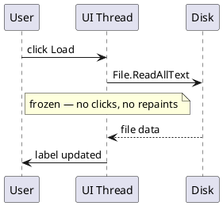
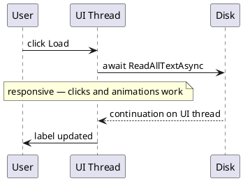

> **Key Takeaways**
>
> - Blocking threads during I/O wastes thread budget, not CPU cycles - the cost is unavailability.
> - Async handlers in web APIs let the same thread serve other requests while I/O is in flight.
> - In desktop apps, async keeps the UI thread free so the app stays responsive during data loads.
> - `.Result` and `.Wait()` defeat the whole purpose - they block threads and risk deadlocks.
> - Prefer `async Task Main` in console apps and keep the async chain intact throughout your codebase.

## The Real Bottleneck in Most Apps Isn't the CPU

In the [previous part](/series/async-await/how-async-await-works-csharp/), we explored how `async`/`await` lets a method pause and resume without losing its place. This part answers why that matters in practice: because the thread waiting on I/O is a thread that can't help with anything else.

Picture a web server handling two hundred requests a second. Each one hits a database. The database is fast — thirty milliseconds on a good day. But multiplied across two hundred concurrent requests, those waits stack up into a wall of occupied threads: threads that aren't computing anything, aren't making decisions, aren't doing work. They're just sitting there, holding memory and a slot in the thread pool, waiting for a row to come back.

That's the cost of blocking on I/O. Not slow code — unavailable threads.

## How Blocking Hurts Your Server

Web APIs process many concurrent requests. In the simplest model - one thread per request - each request claims a thread until it finishes. Threads cost memory (roughly 1 MB of stack space by default in .NET) and the thread pool has a finite budget. It grows, but not without overhead and not without limits.

When a request handler blocks on a database query or an outbound HTTP call, the thread assigned to that request sits frozen - consuming that budget, unavailable to help with any other request. Under load, threads fill up waiting on I/O. New requests queue. Latency climbs. The app looks overloaded while the CPU is mostly idle.

```csharp
// Synchronous: blocks the thread for the entire network round-trip
public IActionResult GetOrder(int id)
{
    using var client = new WebClient(); // WebClient is deprecated since .NET 6 — shown here only to illustrate synchronous blocking
    var json = client.DownloadString($"https://api.example.com/orders/{id}");
    return Ok(JsonSerializer.Deserialize<Order>(json));
}

// Asynchronous: yields while the network call is in flight
public async Task<IActionResult> GetOrderAsync(int id)
{
    var response = await _httpClient.GetAsync($"https://api.example.com/orders/{id}");
    var json = await response.Content.ReadAsStringAsync();
    return Ok(JsonSerializer.Deserialize<Order>(json));
}
```

{: .note }
In real apps, inject a shared `HttpClient` via `IHttpClientFactory` rather than creating a new instance per request. Short-lived `HttpClient` instances can exhaust available socket connections under load.

The async version releases the thread while the network request travels and while the response body is being read. When the response arrives, the state machine picks up a free thread from the pool and resumes from exactly where it paused. The same thread budget handles far more concurrent requests - not because the work runs faster, but because threads aren't held hostage during waits (Figure 1).

**Throughput comparison — blocking vs async request handler:**

```vegalite
{
  "$schema": "https://vega.github.io/schema/vega-lite/v5.json",
  "title": "Relative throughput — same thread budget",
  "width": 300,
  "height": 200,
  "data": {
    "values": [
      {"handler": "Blocking handler", "throughput": 1},
      {"handler": "Async handler",    "throughput": 4.5}
    ]
  },
  "mark": "bar",
  "encoding": {
    "x": {"field": "handler", "type": "ordinal", "axis": {"title": ""}},
    "y": {"field": "throughput", "type": "quantitative", "axis": {"title": "Relative throughput"}}
  }
}
```

### The underlying mechanism

Async I/O in .NET works through OS-level completion mechanisms - I/O Completion Ports on Windows, `epoll`/`kqueue` on Linux and macOS. When an async I/O operation is started, the OS registers the operation and immediately returns. No thread waits. When the OS signals completion, the .NET thread pool picks up the event and calls the continuation. A thread was needed only at the start and at the end - never during the wait. ([Microsoft Learn - TAP overview](https://learn.microsoft.com/en-us/dotnet/standard/asynchronous-programming-patterns/task-based-asynchronous-pattern-tap))

The Task-based Asynchronous Pattern (TAP) in .NET exposes async operations as `Task` or `Task<T>` objects. Under the hood, async I/O calls delegate to OS-level non-blocking APIs that signal completion via thread pool callbacks - meaning no thread is occupied during the wait. The thread pool then schedules the continuation method to run. (Source: Microsoft Learn - Task-based Asynchronous Pattern)

## How Blocking Hurts Your UI

UI frameworks in .NET - WPF, WinForms, MAUI - run on a single message loop thread. That thread handles everything: mouse clicks, keyboard input, repaints, animations, and your application code. There is no second thread for "just the UI." If you block it, everything stops.

```csharp
// Bad: blocks the UI thread while the file is read - window freezes entirely
private void LoadButton_Click(object sender, EventArgs e)
{
    var text = File.ReadAllText(longFilePath);  // blocks
    this.TextBox.Text = text;
}

// Good: yields during the read - window stays responsive
private async void LoadButton_Click(object sender, EventArgs e)
{
    var text = await File.ReadAllTextAsync(longFilePath);
    this.TextBox.Text = text;
}
```

The async version lets the UI thread return to the message loop during the file read. Animations keep playing. The user can click other controls. When the file is ready, the continuation runs on the UI thread - because the UI `SynchronizationContext` was captured at the `await` point - so updating `this.TextBox.Text` is safe without any manual thread marshaling.

**Blocking — UI thread frozen until file is read:**



**Async — UI thread free during the read:**



## The Anti-Pattern That Defeats the Purpose

The most common mistake in async codebases is blocking synchronously on an async call. It undoes everything you gained.

```csharp
// All three of these block the calling thread:
var data = FetchAsync().Result;
var data = FetchAsync().GetAwaiter().GetResult();
FetchAsync().Wait();
```

In environments with a `SynchronizationContext` - WPF, WinForms, ASP.NET Framework - this frequently deadlocks. The UI thread is blocked waiting for the task. The task's continuation is scheduled to run on the UI thread. Neither moves. The app hangs.

The fix is to make the caller async too, and keep the chain intact.

```csharp
// Correct: the thread is freed rather than blocked
var data = await FetchAsync();
```

### If you must bridge sync and async

Sometimes you're forced to call async code from a synchronous context - legacy integrations, platform constraints, or a third-party API with no async overloads. In those cases, wrap the call in `Task.Run` to run on a thread-pool thread without a captured context:

```csharp
// At a genuine sync/async boundary only - not a general-purpose pattern
public static T RunSync<T>(Func<Task<T>> asyncOp) =>
    Task.Run(async () => await asyncOp().ConfigureAwait(false))
        .GetAwaiter()
        .GetResult();
```

Use this sparingly, only at true architectural boundaries, and never inside code that's already inside an async chain.

## What You Actually Gain

Async doesn't make I/O faster. The network round-trip takes the same thirty milliseconds whether you block on it or not. What changes is what the thread does during that wait — and therefore how many requests the same hardware can serve at once.

Write the handler synchronously and your thread count caps your concurrency. Write it with `async`/`await` and threads serve requests in bursts, releasing during waits and picking up new work until the response is ready. Same machines, same I/O latency, higher throughput.

In the [next part](/series/async-await/async-vs-parallel-csharp/), we'll separate asynchrony - freeing threads during waits - from parallelism - using multiple threads to divide CPU computation - and explore when each applies, and when combining both is the right call.
