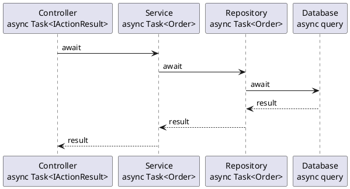

## The Conventions That Keep Async Code From Surprising You

In the [previous part](/series/async-await/designing-reliable-async-methods-csharp/), we covered how to design individual async methods that callers can depend on. This final part is about what happens when you apply those decisions consistently — across a codebase, across a team, across time.

Most async bugs aren't mysterious. They're the same handful of mistakes showing up in different files: blocking on a task, dropping a `CancellationToken`, firing work without handling its exceptions. The conventions here exist because each one prevents a specific category of failure that's annoying to diagnose and easy to avoid.

> **Key Takeaways**
>
> - Mark a method `async` only when it contains a genuine `await` - otherwise return a completed task directly.
> - Keep the async chain intact: if you call async code, be async yourself. Don't break the chain with `.Result` or `.Wait()`.
> - Use `ConfigureAwait(false)` in library and service code; skip it in UI code that needs to return to the UI thread.
> - Name async methods with the `Async` suffix uniformly.
> - Accept and forward `CancellationToken`; treat `OperationCanceledException` as expected flow.
> - Use `Task.WhenAll` for concurrent I/O; `Task.Run` only for CPU-bound work on the thread pool.

## Keep the Async Chain Intact

The single most important habit: if you call an async method, be async yourself and `await` the result. Don't break the chain.

```csharp
// Wrong: breaks the async chain - the calling thread blocks
public void ProcessOrder(string orderId)
{
    var order = FetchOrderAsync(orderId).Result;  // potential deadlock
    Save(order);
}

// Right: propagates asynchrony upward
public async Task ProcessOrderAsync(string orderId)
{
    var order = await FetchOrderAsync(orderId);
    Save(order);
}
```

The async-all-the-way rule isn't dogma for its own sake. It's the consequence of how async I/O works. When you break the chain, you force the calling thread to block, which trades the throughput benefits away and risks deadlocks in context-aware environments like WPF or legacy ASP.NET.

The chain terminates naturally at the top boundary: a controller action, an event handler, a `Main` method, or a background service loop. Those are the only places where the async chain has to end. Everywhere below them, stay async (Figure 1).

**The async chain — from controller to database:**



## `async` Without `await` Is Overhead Without Benefit

A method marked `async` with no `await` inside runs synchronously but still generates a state machine and a `Task` wrapper. The compiler will warn you about this (`CS1998: This async method lacks 'await' operators`). Pay attention to it.

```csharp
// Wrong: generates state machine and Task allocation for nothing
public async Task<string> GetNameAsync() =>
    "Alice";  // no await anywhere

// Right: return a pre-completed Task directly
public Task<string> GetNameAsync() =>
    Task.FromResult("Alice");

// Right: for void-returning async stubs
public Task DoNothingAsync() =>
    Task.CompletedTask;
```

Either add a genuine async operation, or remove the `async` modifier and return a pre-completed task.

## `async void` Only for Event Handlers

Return `Task` from every async method. Reserve `async void` for event handlers only - and even then, wrap the entire body in `try/catch`, because exceptions from `async void` methods can't be caught by callers and may crash the process.

For methods that produce results incrementally, return `IAsyncEnumerable<T>` and let callers consume with `await foreach`:

```csharp
public async IAsyncEnumerable<StockQuote> StreamQuotesAsync(
    string symbol,
    [EnumeratorCancellation] CancellationToken cancellationToken = default)
{
    while (!cancellationToken.IsCancellationRequested)
    {
        var quote = await GetLatestQuoteAsync(symbol, cancellationToken);
        yield return quote;
        await Task.Delay(TimeSpan.FromSeconds(1), cancellationToken);
    }
}

// Consumer:
await foreach (var quote in StreamQuotesAsync("AAPL", cancellationToken))
{
    Display(quote);
}
```

`IAsyncEnumerable<T>` is the right shape for live feeds, paginated APIs, file streams, and any scenario where results arrive over time rather than all at once.

## `ConfigureAwait(false)`: Library Code vs. Application Code

The rule divides cleanly by context.

**In library code and shared services:** use `ConfigureAwait(false)`. Your library doesn't know what synchronization context its caller has. Capturing and posting back to a UI context adds overhead, and in the worst case, deadlocks callers who block on your method.

```csharp
// In a reusable service or NuGet package:
var response = await httpClient.GetAsync(url).ConfigureAwait(false);
var json = await response.Content.ReadAsStringAsync().ConfigureAwait(false);
```

**In application code that accesses UI after the await:** don't use `ConfigureAwait(false)`. Let the context capture happen so the continuation returns to the UI thread.

```csharp
// In a ViewModel, code-behind, or page:
var data = await _service.GetDataAsync();  // context captured
this.Results.ItemsSource = data;           // safe - on the UI thread
```

The most confusing `ConfigureAwait` bugs happen when library code *doesn't* use it, and a synchronous caller in an ASP.NET Framework or WPF app blocks on it with `.Result`. The continuation tries to marshal back to the context. The context is blocked. Neither moves. The classic deadlock - and the fix is backward: add `ConfigureAwait(false)` to the library, not to the caller.

In ASP.NET Core, `ConfigureAwait(false)` has no functional effect at runtime (there's no `SynchronizationContext`), but it still documents intent and future-proofs the code.

## Honor Cancellation All the Way Down

Pass `CancellationToken` to every async API you call. Don't accept it at the entry point and then stop forwarding it internally.

```csharp
public async Task<Report> GenerateReportAsync(
    ReportOptions options,
    CancellationToken cancellationToken = default)
{
    // Forward the token at every step
    var data      = await _dataService.FetchAsync(options, cancellationToken);
    var template  = await _templateStore.LoadAsync(options.TemplateId, cancellationToken);
    var rendered  = await _renderer.RenderAsync(data, template, cancellationToken);
    return rendered;
}
```

In CPU-bound loops that don't call async APIs, check the token explicitly using `token.ThrowIfCancellationRequested()`:

```csharp
for (int i = 0; i < items.Length; i++)
{
    cancellationToken.ThrowIfCancellationRequested();
    Process(items[i]);
}
```

Treat `OperationCanceledException` as expected completion. Don't log it as an error. Don't re-throw it as a generic exception. Catch it, clean up if needed, and let it propagate or swallow it deliberately.

## Handle Fire-and-Forget Exceptions Explicitly

When you fire a task without awaiting it, exceptions stored in that task will be silently swallowed in .NET 4.5 and later. If you must fire and forget, make the method responsible for its own error handling:

```csharp
// Discarding the task: exceptions will silently disappear
_ = DoBackgroundWorkAsync();

// Better: the method catches and logs its own exceptions
private async Task DoBackgroundWorkAsync()
{
    try
    {
        await ActualWorkAsync();
    }
    catch (Exception ex)
    {
        _logger.LogError(ex, "Background work failed silently.");
    }
}
```

In hosted services (`IHostedService`, `BackgroundService`), background tasks that throw can die silently without any visible symptom in the application. If the background loop throws and isn't caught, the service stops and may not be restarted depending on the host configuration. Always wrap the main loop of a background service in a `try/catch` with logging - silent failure in background work is much harder to diagnose than a visible exception.

## Avoid `Task.Run` on ASP.NET Core Hot Paths

`Task.Run` schedules work on the thread pool - which is exactly where ASP.NET Core request handling already runs. Wrapping I/O in `Task.Run` on a server moves work from one thread-pool thread to another, adding scheduling overhead without any throughput benefit.

```csharp
// In ASP.NET Core: this adds overhead without benefit for I/O
public async Task<IActionResult> GetOrdersAsync(string id)
{
    var orders = await Task.Run(() => FetchOrdersAsync(id).Result);  // wrong
    return Ok(orders);
}

// Correct: call the async API directly
public async Task<IActionResult> GetOrdersAsync(string id)
{
    var orders = await _orderService.FetchOrdersAsync(id);
    return Ok(orders);
}
```

`Task.Run` belongs on servers in exactly two situations: offloading genuinely CPU-bound work (image processing, PDF generation, heavy computation), and bridging a truly synchronous third-party library that has no async API. Don't use it as a wrapper for I/O calls.

## A Checklist Before You Ship

Before async code goes into review, cover these:

- [ ] Every async method returns `Task` or `Task<T>` - no `async void` outside event handlers.
- [ ] No `.Result`, `.Wait()`, or `.GetAwaiter().GetResult()` in an async call chain.
- [ ] `CancellationToken` accepted and forwarded at each async call.
- [ ] `ConfigureAwait(false)` used in library and service code; absent in UI-context code.
- [ ] `async` methods without `await` removed or corrected.
- [ ] No `Task.Run` wrapping I/O calls on ASP.NET Core request paths.
- [ ] Fire-and-forget tasks handle their own exceptions internally.

These aren't micromanagement - they're the conventions that prevent the most common async bugs, and they're fast to verify.

---

Async programming rewards attention to detail. The keywords are small; the machinery behind them is surprisingly rich. The habits in this part are what let a team work with async code at scale without every merge being a debugging session.

This series has traced async from the conceptual layer - not wasting the wait - through the mechanical layer - state machines, continuations, synchronization context - to the practical layer - designing, composing, and maintaining reliable async code. Each layer depends on the one below. Understanding why async exists makes the rules intuitive. Understanding how the state machine works makes the edge cases predictable. Understanding the design patterns makes the code maintainable.

Async programming has a learning curve that's steeper than it looks. The keywords are small; the machinery behind them takes time to build intuition for. But the edge cases in this series — deadlocks, swallowed exceptions, context mismatches, fire-and-forget failures — all follow from the same underlying mechanics. Once those mechanics are clear, the right habits follow naturally. The checklist at the end of this part isn't a set of rules to memorize. It's a compressed version of what those mechanics demand.
