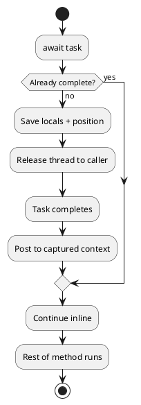

## The Question That Only Matters When It Breaks

In the [previous part](/series/async-await/async-vs-parallel-csharp/), we covered the difference between async I/O and parallel computation, and when to apply each. This part asks a subtler question: once an `await` completes and the method is ready to resume, *where* does it resume? On which thread? In which context?

This matters more than it seems. In a desktop app, UI elements can only be accessed from the UI thread - if the continuation runs on a thread-pool thread, any attempt to update the interface throws a cross-thread exception. In library code, capturing the caller's synchronization context can introduce unexpected overhead, and in the worst case, cause deadlocks in code you'll never see yourself.

The answer to "where does async resume?" involves two mechanisms: **continuations** and **synchronization contexts**.

> **Key Takeaways**
>
> - A continuation is the code that runs after an `await` completes - generated and registered by the state machine.
> - By default, `await` captures the current `SynchronizationContext` and posts the continuation back to it.
> - In WPF, WinForms, and MAUI, the UI `SynchronizationContext` ensures continuations run on the UI thread.
> - In ASP.NET Core, there is no `SynchronizationContext`, so continuations run on a thread-pool thread.
> - `ConfigureAwait(false)` skips context capture - the continuation runs on whatever thread-pool thread is free.

## What Is a Continuation?

Every `await` expression divides an async method into two pieces: the code before the pause, and the code after. The "after" part is the **continuation** - the code that must run once the awaited operation completes.

When you write:

```csharp
var data = await FetchAsync();
Console.WriteLine(data.Length);  // this line is the continuation
```

The compiler captures everything from `Console.WriteLine(data.Length)` onward - and the local variable `data`, and the current execution state - as the work to resume. The state machine registers the continuation with the task's completion mechanism, then releases the thread.

When the task completes (on a background I/O thread, a timer callback, or wherever the OS signals), the state machine doesn't run the continuation directly. It posts it to the right place - determined by the context captured when `await` was first called (Figure 1).

**The await decision tree — suspend or continue inline:**



## The SynchronizationContext

`SynchronizationContext` is .NET's abstraction for "how to schedule work on a specific context." Every UI framework provides its own implementation:

- **WPF**: `DispatcherSynchronizationContext` - queues work on the Dispatcher thread.
- **WinForms**: `WindowsFormsSynchronizationContext` - queues work via the message pump.
- **MAUI**: similar, targeting the main UI thread.

When `await` captures the current `SynchronizationContext`, it saves a reference to the scheduling context active at that moment. When the continuation runs, the state machine posts it there.

```csharp
// In a WPF button handler:
private async void LoadButton_Click(object sender, RoutedEventArgs e)
{
    // SynchronizationContext here is the WPF UI context
    var text = await File.ReadAllTextAsync(path);

    // Continuation runs on the UI thread (context was captured above)
    this.TextBlock.Text = text;  // safe - we're on the UI thread
}
```

Without context capture, the continuation might run on a thread-pool thread, and accessing `this.TextBlock.Text` would throw an `InvalidOperationException`: the calling thread cannot access the object because a different thread owns it.

The first time you hit a cross-thread exception after an `await`, it seems cryptic - the code looks correct, the variable is set, why is it crashing? Once you understand that continuations run on whatever thread posted them, the cause becomes obvious: the context wasn't what you expected. Knowing that `await` captures the `SynchronizationContext` by default makes this predictable rather than mysterious.

### What happens in ASP.NET Core?

ASP.NET Core deliberately registers no `SynchronizationContext`. The framework was built for thread-pool execution from the start - maintaining thread affinity at every await point would add overhead and remove flexibility. When `SynchronizationContext.Current` is null, the `await` mechanism falls back to `TaskScheduler.Current`, which in the absence of a custom scheduler defaults to the thread-pool scheduler.

Continuations in ASP.NET Core run on available thread-pool threads. There's no specific thread they need to return to. This is a deliberate design that scales well.

## ConfigureAwait(false): Opting Out of Context Capture

When you want to skip context capture explicitly - usually in library code, shared services, or any code that doesn't need UI thread affinity - use `ConfigureAwait(false)`.

```csharp
// Library code: run continuation on any available thread-pool thread
var json = await httpClient.GetStringAsync(url).ConfigureAwait(false);
var result = Process(json);
```

`ConfigureAwait(false)` tells the awaiter: "I don't need to resume on the original context - just resume me on the thread pool." This avoids the cost of posting to a specific context, and more importantly, prevents library code from capturing a caller's context that it doesn't own.

**Use `ConfigureAwait(false)` in:**
- NuGet packages and reusable libraries.
- Backend service code, worker services, and console applications.
- Any code that doesn't access UI elements after the `await`.

**Don't use `ConfigureAwait(false)` before code that touches UI:**

```csharp
// Wrong: continuation runs on thread pool - UI access throws
var text = await File.ReadAllTextAsync(path).ConfigureAwait(false);
this.Label.Text = text;  // cross-thread exception

// Correct: context captured - continuation returns to UI thread
var text = await File.ReadAllTextAsync(path);
this.Label.Text = text;  // safe
```

In ASP.NET Core, `ConfigureAwait(false)` has no functional effect at runtime because there's no `SynchronizationContext` to opt out of. But it still carries value as documentation - it signals to readers that this code has no thread-affinity requirement. And it protects the code if it's ever extracted into a library or called from a context-aware environment, like a UI layer or a legacy ASP.NET Framework host.

## When the Task Is Already Complete: The Fast Path

`await` has a synchronous fast path. Before suspending, it checks whether the task is already complete. If the value is already available - from a cache hit, a pre-resolved result, or an in-memory operation - the continuation runs inline. No suspension, no context post, no allocation.

```csharp
// If GetCachedValueAsync returns a completed task:
var value = await GetCachedValueAsync(key);  // fast path - no suspension
```

This is crucial to understanding `ValueTask`. A `ValueTask<T>` method can return a synchronously-completed value wrapping a struct rather than allocating a heap `Task<T>` object. When the fast path is taken, nothing is allocated at all. This is the optimization `ValueTask` was designed for - eliminating the allocation cost on hot, frequently-synchronous paths (Figure 2).

**Relative overhead per await completion path:**

```vegalite
{
  "$schema": "https://vega.github.io/schema/vega-lite/v5.json",
  "title": "Relative overhead per await completion path",
  "width": 400,
  "height": 200,
  "data": {
    "values": [
      {"path": "Sync fast path",                "cost": 1},
      {"path": "Async + ConfigureAwait(false)",  "cost": 3},
      {"path": "Async + context capture",        "cost": 7}
    ]
  },
  "mark": "bar",
  "encoding": {
    "x": {
      "field": "path", "type": "ordinal",
      "sort": ["Sync fast path", "Async + ConfigureAwait(false)", "Async + context capture"],
      "axis": {"title": ""}
    },
    "y": {"field": "cost", "type": "quantitative", "axis": {"title": "Relative cost (illustrative)"}}
  }
}
```
*Values are illustrative relative costs. For measured data, see Stephen Toub's [ConfigureAwait FAQ](https://devblogs.microsoft.com/dotnet/configureawait-faq/) on the .NET Blog.*

## Putting the Pieces Together

Continuations provide correctness. Without them, a method that resumed on the wrong thread would either crash in a UI app or introduce subtle race conditions in a server. The `SynchronizationContext` mechanism makes context-aware resumption automatic when needed. `ConfigureAwait(false)` makes it opt-out when it isn't.

The pattern to internalize: `await` captures the current context by default. That's correct behavior in UI code — continuations return to the UI thread, and you can safely update controls without any marshaling. In library and backend code the capture is unnecessary, and in legacy ASP.NET it can cause deadlocks. `ConfigureAwait(false)` makes the intent explicit and prevents those problems. For a thorough breakdown of every scenario, Stephen Toub's [ConfigureAwait FAQ](https://devblogs.microsoft.com/dotnet/configureawait-faq/) is the definitive reference.

In the [next part](/series/async-await/async-exception-handling-csharp/), we'll look at what happens when something goes wrong inside the async chain - how exceptions travel through tasks, where they surface, and why `async void` is the one pattern that makes exceptions disappear entirely.
