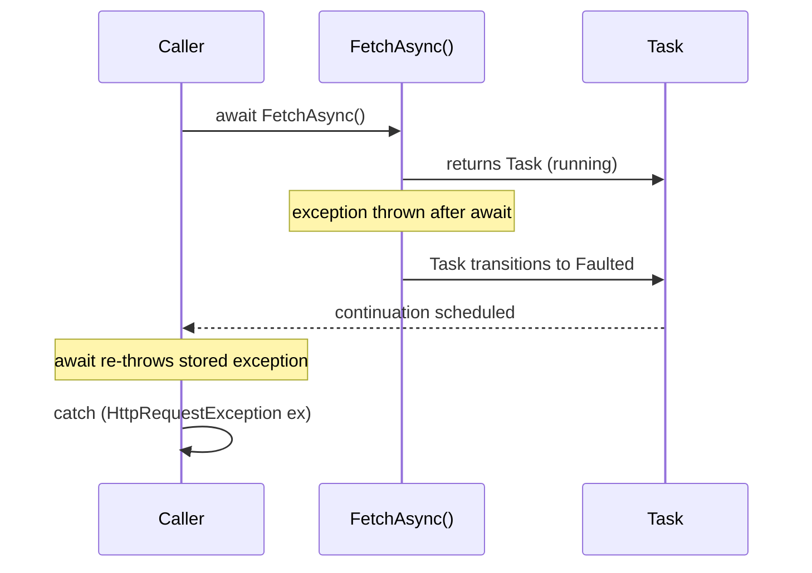
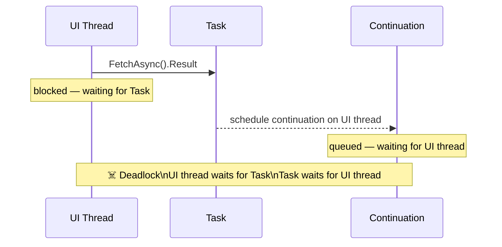

## Exceptions Don't Stay Where They Started

In the [previous part](/series/async-await/async-continuations-synchronizationcontext/), we learned how continuations carry the method forward after an `await`. This part deals with what happens when something inside that chain goes wrong. The short answer: exceptions still propagate, but they travel *through the task* and arrive *at the await point* - not at the throw site.

Miss this distinction once and you'll spend an afternoon staring at a stack trace that points nowhere useful.

> **Key Takeaways**
>
> - Exceptions thrown before the first `await` propagate synchronously - they're still stored in the `Task`, not thrown directly.
> - Exceptions thrown after an `await` are captured by the returned `Task` and re-thrown when that task is awaited.
> - `async void` methods can't have exceptions observed by callers - they crash the process.
> - `.Result`, `.Wait()`, and `.GetAwaiter().GetResult()` all block threads; `.Result` and `.Wait()` also wrap exceptions in `AggregateException`.
> - `Task.WhenAll` throws only the first exception when awaited - inspect faulted tasks individually for the full picture.
> - Treat `OperationCanceledException` as expected flow, not a failure.

## How Exceptions Travel Through Tasks

The state machine - the compiler-generated struct that drives every async method - catches all exceptions that escape the method body and stores them on the returned `Task`. The task transitions to the `Faulted` state. Nothing is thrown at the call site yet.

When a caller `await`s that faulted task, the stored exception is re-thrown at the `await` point. A `try/catch` around the `await` will catch it, just as it would in synchronous code - with one important difference: the stack trace reflects where the exception was rethrown (at the `await`), not where it originally occurred. In .NET 4.5 and later, the original stack trace is preserved where possible through `ExceptionDispatchInfo`.

```csharp
private async Task<string> FetchAsync(string url)
{
    using var http = new HttpClient();
    // If GetAsync throws (network error, DNS failure, etc.),
    // the exception is stored in the returned Task.
    var response = await http.GetAsync(url);
    response.EnsureSuccessStatusCode();
    return await response.Content.ReadAsStringAsync();
}

// Caller:
try
{
    var data = await FetchAsync("https://api.example.com/data");
    Display(data);
}
catch (HttpRequestException ex)
{
    ShowError($"Network error: {ex.Message}");
}
catch (Exception ex)
{
    Log(ex);
    ShowError("An unexpected error occurred.");
}
```

The exception surfaces at `await FetchAsync(...)`, not inside `FetchAsync` itself. Catch it there, at the await point where you have the right context to handle it (Figure 1).

**Exception propagation — stored in Task, re-thrown at the await point:**



### Exceptions before the first await

There's a nuance worth knowing. In an `async` method, even an exception thrown before any `await` is technically stored in the returned `Task` - because the compiler wraps the entire method body in a try/catch inside `MoveNext()`. This means argument validation at the start of an async method doesn't throw synchronously at the call site; it produces a faulted task.

For library code where you want argument exceptions to throw immediately - before the caller even has a chance to await - separate the public method from the async implementation:

```csharp
// Public method: validates synchronously
public Task<string> FetchAsync(string url)
{
    ArgumentNullException.ThrowIfNull(url, nameof(url));
    return FetchCoreAsync(url);  // delegate to private async core
}

// Private async core: does the real work
private async Task<string> FetchCoreAsync(string url)
{
    using var http = new HttpClient();
    var response = await http.GetAsync(url);
    return await response.Content.ReadAsStringAsync();
}
```

This pattern is rare in application code but valuable in reusable APIs where the caller should fail fast on bad input.

## The `async void` Trap

`async void` is the exception that causes crashes. Literally.

When an `async void` method throws after an `await`, there's no `Task` to store the exception in. It has nowhere to go. The exception is posted to the current `SynchronizationContext`'s unhandled exception handler. In most app hosts, that terminates the process.

```csharp
// This will crash the application - no Task, nowhere to catch it
async void DoSomethingUnsafe()
{
    await Task.Delay(500);
    throw new Exception("No one will catch this.");
}

// The caller can't protect itself
DoSomethingUnsafe();  // fire and forget - but also: crash and burn
```

The only legitimate use for `async void` is event handlers, where the framework requires a `void` signature. Even there, wrap the body in a `try/catch`:

```csharp
private async void SaveButton_Click(object sender, RoutedEventArgs e)
{
    try
    {
        await SaveDocumentAsync();
        StatusLabel.Text = "Saved.";
    }
    catch (IOException ex)
    {
        StatusLabel.Text = "Save failed - check your disk.";
        Log(ex);
    }
    catch (Exception ex)
    {
        StatusLabel.Text = "An unexpected error occurred.";
        Log(ex);
    }
}
```

In .NET 4.0, unobserved task exceptions - exceptions stored in a `Task` that was never awaited or observed - would terminate the process via `TaskScheduler.UnobservedTaskException`. This was changed in .NET 4.5: unobserved task exceptions are silently swallowed by default. This is safer but can hide real bugs. If you fire a task without awaiting it, any exception it throws will silently disappear unless the task's `Exception` property is read or `TaskScheduler.UnobservedTaskException` is subscribed to.

## `.Result`, `.Wait()`, and `.GetAwaiter().GetResult()`

All three synchronously block on an async task. None of them belong in general async code.

The first problem is exception wrapping. Where `await` re-throws the original exception, `.Result` and `.Wait()` wrap it in an `AggregateException`:

```csharp
// With .Result: exception is wrapped
try
{
    var result = FetchAsync().Result;
}
catch (AggregateException ex)
{
    var real = ex.InnerException;  // have to unwrap
}

// With await: original exception type preserved
try
{
    var result = await FetchAsync();
}
catch (HttpRequestException ex)
{
    // Caught correctly - no unwrapping needed
}
```

`.GetAwaiter().GetResult()` avoids the `AggregateException` wrapping, but it still blocks and still risks deadlocks.

The second problem is deadlock. In a context-bound environment (WPF, WinForms, ASP.NET Framework), the continuation is scheduled to run on the UI or request thread. If you block that same thread with `.Result`, neither can proceed: the thread waits for the continuation, and the continuation waits for the thread. The application hangs (Figure 2).

The rule is simple: in async code, use `await`. Not `.Result`. Not `.Wait()`. Not `.GetAwaiter().GetResult()` on a context-bound thread.

**Deadlock — blocking on a Task that needs the current thread:**



## Handling Multiple Tasks

`Task.WhenAll` runs multiple tasks concurrently and waits for all of them. When one or more fail, it throws only the first exception when awaited. The remaining exceptions are stored on the returned task's `Exception.InnerExceptions` collection.

```csharp
var userTask   = FetchUserAsync(userId);
var ordersTask = FetchOrdersAsync(userId);

try
{
    await Task.WhenAll(userTask, ordersTask);
}
catch (Exception)
{
    // This is only the first exception.
    // Inspect each task directly to capture all failures:
    if (userTask.IsFaulted)
        HandleError("user fetch", userTask.Exception!.InnerException!);

    if (ordersTask.IsFaulted)
        HandleError("orders fetch", ordersTask.Exception!.InnerException!);
}
```

If you need to process all exceptions, inspect each faulted task individually after `Task.WhenAll` throws - don't rely solely on the caught exception.

## Cancellation Is Not a Failure

`OperationCanceledException` occupies a special place in the async exception model. It's not a sign that something went wrong - it's the signal that work was deliberately stopped. Treat it as expected flow, not as an error.

```csharp
public async Task LoadAsync(CancellationToken cancellationToken)
{
    try
    {
        var data = await GetDataAsync(cancellationToken);
        Render(data);
    }
    catch (OperationCanceledException) when (cancellationToken.IsCancellationRequested)
    {
        // Expected: caller stopped the operation
        // No logging needed, no error UI required
    }
    catch (Exception ex)
    {
        // Real errors: log and report
        ShowError("Failed to load.");
        Log(ex);
    }
}
```

The `when (cancellationToken.IsCancellationRequested)` guard is precise: it catches `OperationCanceledException` only when *your* cancellation token was the cause - not when a different library cancels for its own reasons inside the same call chain.

## Quick Reference: Async Error Handling Rules

- `await` re-throws original exceptions with full type information. Wrap it in `try/catch` where you expect failures.
- `async void` event handlers: wrap the entire body in `try/catch` or exceptions will crash the process.
- Never block with `.Result` or `.Wait()` in an async call chain.
- After `Task.WhenAll`, check each individual faulted task to capture all exceptions.
- Catch `OperationCanceledException` separately and treat it as normal completion.

Async exceptions travel through the task chain and surface at the `await` point. Once you expect that, the catch site feels obvious — it's the same place you'd handle any other failure in the calling code.

In the [next part](/series/async-await/designing-reliable-async-methods-csharp/), we'll look at how to design async methods that communicate clearly about their completion, their failures, and their intent - so callers can depend on them without guessing.
