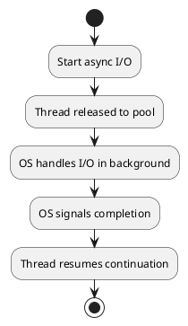
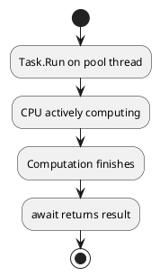
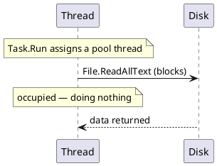
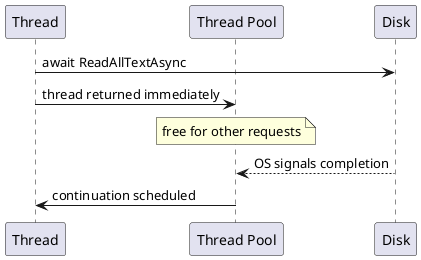

* TOC
{:toc}

## Two Different Answers to Two Different Problems

In the [previous part](/series/async-await/async-await-throughput-responsiveness/), we saw how `async`/`await` turns thread-blocking into thread-freeing during I/O. But async programming is only part of the picture. Sometimes the bottleneck isn't waiting - it's the work itself: heavy computation that keeps the CPU genuinely occupied.

These two cases call for fundamentally different solutions. Mixing them up - treating async as a universal performance fix, or wrapping synchronous I/O in `Task.Run` when a true async API exists - is one of the most common performance mistakes in .NET.

The kitchen metaphor still holds. **Asynchrony is about timing**: the cook steps aside while the oven works. **Parallelism is about teamwork**: several cooks work simultaneously to divide a large task. Both improve throughput. Neither replaces the other.

## I/O-Bound vs. CPU-Bound: The Essential Distinction

The nature of the work determines which tool applies.

**I/O-bound** operations spend most of their time waiting for something external: a network socket to return data, a disk read to complete, a database query to execute. The CPU is idle during the wait. The problem isn't compute capacity - it's patience. Async/await handles this by releasing the thread during the wait and resuming when the signal arrives. No extra threads are created during the I/O.

**CPU-bound** operations keep the processor genuinely busy: sorting large datasets, compressing images, running numerical simulations, rendering video frames. The CPU is the bottleneck. Releasing a thread doesn't help - the work requires a CPU. What helps is distributing that work across multiple cores.

```csharp
// I/O-bound: no thread held during the network wait
using var http = new HttpClient();
var json = await http.GetStringAsync("https://api.example.com/data");

// CPU-bound: divides heavy work across available cores
Parallel.For(0, inputData.Length, i =>
{
    results[i] = ComputeHeavy(inputData[i]);
});
```

Microsoft's guidance on this distinction is explicit:

- **I/O-bound**: use `async`/`await` without `Task.Run`. The OS handles the wait; no thread is needed.
- **CPU-bound**: use `async`/`await` with `Task.Run` to offload the computation to a thread-pool thread. ([Microsoft Learn - Async scenarios](https://learn.microsoft.com/en-us/dotnet/csharp/asynchronous-programming/async-scenarios))

**I/O-Bound — thread released while waiting:**



**CPU-Bound — thread actively computing:**



### The rule of thumb

Ask yourself: is your code waiting for something external, or is it doing something itself?

Waiting for a server, a file, a database - reach for `async`/`await`. Transforming data, encoding media, running algorithms - reach for `Parallel.For`, PLINQ, or `Task.Run`.

## Using `Task.Run` for CPU-Bound Work

`Task.Run` offloads a delegate to the thread pool. It's the right tool when you have CPU-bound work that would otherwise occupy the calling thread - typically to keep a UI handler responsive while computation proceeds on a background thread.

```csharp
// In a UI app: keep the button click handler responsive
private async void ProcessButton_Click(object sender, EventArgs e)
{
    this.StatusLabel.Text = "Processing...";
    var result = await Task.Run(() => HeavyTransform(inputData));
    this.ResultLabel.Text = result.ToString();
}
```

`Task.Run` moves `HeavyTransform` to a thread-pool thread. The UI thread is freed during the computation. When processing completes, the `await` resumes on the UI thread (because the UI `SynchronizationContext` was captured), so updating the labels is safe.

### Don't use `Task.Run` to wrap I/O

This is worth emphasizing because it's a persistent mistake:

```csharp
// Wrong: a thread-pool thread blocks waiting for disk I/O
var text = await Task.Run(() => File.ReadAllText(path));

// Right: OS-level async I/O - no thread held during the read
var text = await File.ReadAllTextAsync(path);
```

`Task.Run(() => File.ReadAllText(path))` doesn't use async I/O. It occupies a thread-pool thread while waiting for the disk - trading one blocked thread for another, with added scheduling overhead. Use the async version of the API instead. The same applies to database calls, HTTP requests, and any other I/O: prefer the framework's own async APIs over wrapping sync calls in `Task.Run`.

**`Task.Run` wrapping sync I/O — thread still blocked:**



**True async I/O — no thread held during the wait:**



## Composing Async and Parallel Work

Real systems often need both. A web API might fetch data concurrently from multiple services, then process the combined result in parallel before returning the response.

```csharp
// Step 1: Fetch concurrently (async I/O - no extra threads during the waits)
var usersTask   = _userService.GetAllAsync(cancellationToken);
var ordersTask  = _orderService.GetAllAsync(cancellationToken);
var catalogTask = _catalogService.GetAllAsync(cancellationToken);

await Task.WhenAll(usersTask, ordersTask, catalogTask);

var users   = usersTask.Result;   // safe - task is complete
var orders  = ordersTask.Result;
var catalog = catalogTask.Result;

// Step 2: Enrich in parallel (CPU-bound - spread across cores)
var enriched = await Task.Run(() =>
    users.AsParallel()
         .Select(u => EnrichWithOrders(u, orders, catalog))
         .ToList());
```

`Task.WhenAll` composes concurrent I/O without creating any extra threads - it's purely scheduling multiple completions. `Task.Run` then creates actual OS-level thread-pool work for the CPU-heavy enrichment step. Both improve throughput, but through entirely different mechanisms. Using `Task.WhenAll` for CPU work won't parallelize it. Using `Task.Run` for I/O won't free threads. They're not interchangeable.

## `Parallel.For` and PLINQ for Data-Parallel Work

For workloads where you apply the same operation to a large collection, the Task Parallel Library's `Parallel.For`, `Parallel.ForEach`, and PLINQ (`AsParallel()`) divide that work automatically across the thread pool.

```csharp
// Process each image across available cores
Parallel.ForEach(images, image =>
{
    ProcessImage(image);  // runs on multiple threads concurrently
});

// PLINQ: parallel LINQ for data transformation pipelines
var results = rawData
    .AsParallel()
    .Where(x => x.IsValid)
    .Select(x => Transform(x))
    .ToList();
```

These aren't async - they block synchronously until all work finishes. That's appropriate for CPU-heavy batch work, where you want to occupy the CPU fully and return a result when it's done.

## Choosing the Right Tool

| Work type | Bottleneck | Right approach |
| --- | --- | --- |
| Network call | External signal (I/O) | `async`/`await` with async HTTP API |
| Database query | External resource (I/O) | `async`/`await` with async ADO/EF API |
| File read or write | Disk I/O | `async`/`await` with async File APIs |
| Image processing | CPU | `Parallel.ForEach`, PLINQ |
| Data transformation | CPU | `Parallel.ForEach`, PLINQ |
| CPU work on UI thread | CPU + thread protection | `await Task.Run(...)` |
| Multiple concurrent I/O calls | Scheduling | `Task.WhenAll` |

Knowing which category your work falls into is the first decision. Async frees threads from waiting. Parallel divides work across cores. Use each where it fits - and when a task is large enough, combine them deliberately.

In the [next part](/series/async-await/async-continuations-synchronizationcontext/), we'll look at what happens when the wait ends: how the state machine picks up, which thread it resumes on, and what `ConfigureAwait(false)` actually controls in practice.
