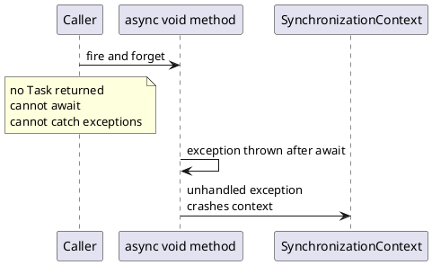
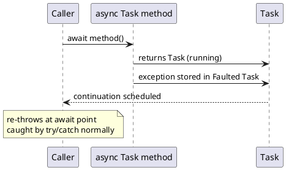
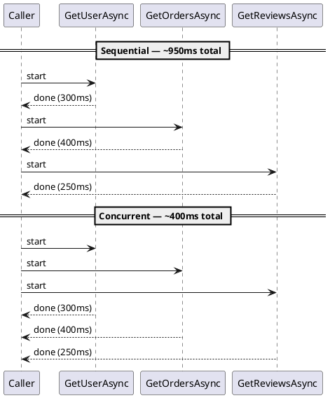

## What Makes an Async Method Trustworthy?

In the [previous part](/series/async-await/async-exception-handling-csharp/), we learned how exceptions travel through tasks and where to catch them. But preventing problems is better than recovering from them. Designing reliable async methods starts one step earlier: making the method predictable in how it runs, how it finishes, and how it reports problems - before any caller ever awaits it.

A trustworthy async method makes a clear contract: await me and I'll return a result or a meaningful error. I'll honor a cancellation request. I don't silently succeed while the work has actually failed. That clarity is what lets callers compose your method safely, handle failures correctly, and cancel cleanly without guessing.

> **Key Takeaways**
>
> - Always return `Task` or `Task<T>` - never `async void` except in event handlers.
> - Accept and forward `CancellationToken` to every async API you call.
> - Name async methods with the `Async` suffix to document the contract.
> - Choose `ValueTask` only after profiling confirms allocation savings on hot, frequently-synchronous paths.
> - Avoid mixing sync and async in one method - no `.Result` or `.Wait()` calls inside an async method.
> - Use `Task.WhenAll` for concurrent I/O; `Task.Run` only for genuinely CPU-bound work.

## Return `Task`, Not `void`

The most important decision in an async method's signature is the return type. `Task` and `Task<T>` are the standard choices - the envelope that carries the method's completion state, its result, and any exception that occurred.

When a caller `await`s your method, they receive all three. When they can't `await` - because you returned `void` - they get nothing: no completion signal, no exceptions, no ability to chain further work on the result.

```csharp
// Wrong: callers can't await, observe errors, or chain work
async void LoadDataUnsafe()
{
    var data = await FetchAsync();
    Display(data);
}

// Right: Task lets callers await, observe errors, and compose
async Task LoadDataAsync()
{
    var data = await FetchAsync();
    Display(data);
}
```

`async void` is acceptable in exactly one case: event handlers, because the framework requires it and there's no alternative. In all other cases - background methods, fire-and-forget helpers, library code, test helpers - return `Task` (Figures 1 and 2).

**`async void` — exceptions have nowhere to go:**



**`async Task` — exceptions travel through the Task:**



### Return types at a glance

| Return type | Use when |
| --- | --- |
| `Task` | Operation completes with no return value |
| `Task<T>` | Operation completes with a result |
| `ValueTask` / `ValueTask<T>` | Operation frequently completes synchronously (e.g. cache hits). Use only after profiling |
| `IAsyncEnumerable<T>` | Results arrive incrementally, consumed with `await foreach` |
| `void` | Event handlers only |

`Task<T>` is the right default. Move to `ValueTask<T>` only when you have measurement showing the allocation is a measurable bottleneck - typically when the operation completes synchronously most of the time and the method is in a genuinely hot path.

## Accept and Forward `CancellationToken`

Every async method that does meaningful I/O or computation should accept a `CancellationToken` parameter. It's a cooperative cancellation signal: the caller (a timeout, a user action, a shutdown event) triggers cancellation; your method passes the token to every async API it calls, which check it and throw `OperationCanceledException` when cancelled.

```csharp
public async Task<IReadOnlyList<Product>> GetProductsAsync(
    string category,
    CancellationToken cancellationToken = default)
{
    // Forward the token to every async call
    var response = await _httpClient.GetAsync(
        $"https://api.example.com/products?category={category}",
        cancellationToken
    );
    response.EnsureSuccessStatusCode();

    var json = await response.Content.ReadAsStringAsync(cancellationToken);
    return JsonSerializer.Deserialize<List<Product>>(json) ?? Array.Empty<Product>();
}
```

When the token is cancelled, the awaited API throws `OperationCanceledException`. The exception propagates through the task chain. Callers should handle it as expected flow, not an error - we covered this in [part 6](/series/async-await/async-exception-handling-csharp/).

The `= default` default value for `CancellationToken` is both conventional and intentional. `CancellationToken.None` (the default value of the struct) is a token that is never cancelled. This makes your method usable without a token - in tests, scripts, or fire-and-forget scenarios - without losing the ability to pass one when the caller has it. The parameter costs nothing when unused.

## Name Methods Consistently with the `Async` Suffix

The `Async` suffix is a contract in .NET - it signals that this method returns an awaitable type and should be awaited. It disambiguates async versions from sync overloads, and it tells readers at a glance what kind of method they're calling.

```csharp
// Sync version: returns T directly
string GetName(int id);

// Async version: returns Task<T>, should be awaited
Task<string> GetNameAsync(int id);
```

Microsoft's official naming convention ([TAP guidelines](https://learn.microsoft.com/en-us/dotnet/standard/asynchronous-programming-patterns/task-based-asynchronous-pattern-tap)) recommends the `Async` suffix for all methods that return `Task`, `Task<T>`, `ValueTask`, `ValueTask<T>`, or `IAsyncEnumerable<T>`. Apply it consistently - including private async methods that are awaited internally.

## Prefer True Async I/O Over `Task.Run` Wrappers

A common temptation - especially when working with older or third-party code - is to wrap synchronous I/O calls in `Task.Run` to give them an awaitable surface:

```csharp
// Antipattern: a thread-pool thread blocks on synchronous I/O
public Task<string> ReadFileAsync(string path) =>
    Task.Run(() => File.ReadAllText(path));
```

This doesn't use async I/O. It occupies a thread-pool thread during the file read - changing which thread blocks, but not eliminating the block. Use the genuine async API:

```csharp
// Correct: uses OS-level async I/O - no thread occupied during the read
public Task<string> ReadFileAsync(string path) =>
    File.ReadAllTextAsync(path);
```

`Task.Run` is appropriate for genuinely CPU-bound work that would otherwise occupy the calling thread. It's not a substitute for missing async APIs, and it's not a way to make synchronous I/O "less blocking."

## Compose Concurrent I/O with `Task.WhenAll`

When you have multiple independent async operations, don't `await` them sequentially if they can run at the same time:

```csharp
// Sequential: combined wait = sum of all three (e.g. 300ms + 400ms + 250ms = 950ms)
var user    = await GetUserAsync(userId, cancellationToken);
var orders  = await GetOrdersAsync(userId, cancellationToken);
var reviews = await GetReviewsAsync(userId, cancellationToken);

// Concurrent: combined wait = max of all three (e.g. ~400ms)
var userTask    = GetUserAsync(userId, cancellationToken);
var ordersTask  = GetOrdersAsync(userId, cancellationToken);
var reviewsTask = GetReviewsAsync(userId, cancellationToken);

await Task.WhenAll(userTask, ordersTask, reviewsTask);

var user    = userTask.Result;    // safe - task is complete
var orders  = ordersTask.Result;
var reviews = reviewsTask.Result;
```

**Sequential vs concurrent I/O — wall-clock time comparison:**


*Sequential total: ~950 ms. Concurrent total: ~400 ms (max of the three).*

If any task fails, `Task.WhenAll` throws when awaited. Inspect each faulted task individually to handle all exceptions - see [part 6](/series/async-await/async-exception-handling-csharp/) for the full pattern.

## A Complete, Reliable Async Signature

Putting the patterns together, a well-designed async method looks like this:

```csharp
public async Task<IReadOnlyList<Order>> GetOrdersAsync(
    string customerId,
    CancellationToken cancellationToken = default)
{
    ArgumentException.ThrowIfNullOrEmpty(customerId, nameof(customerId));

    var response = await _httpClient
        .GetAsync($"https://api.example.com/orders/{customerId}", cancellationToken)
        .ConfigureAwait(false);

    response.EnsureSuccessStatusCode();

    var json = await response.Content
        .ReadAsStringAsync(cancellationToken)
        .ConfigureAwait(false);

    return JsonSerializer.Deserialize<List<Order>>(json) ?? Array.Empty<Order>();
}
```

What this method does right: it returns `Task<IReadOnlyList<Order>>` (observable, awaitable, immutable surface); validates input before any async work; accepts and forwards `CancellationToken`; uses `ConfigureAwait(false)` (library/service code, no UI dependency); propagates HTTP errors through `EnsureSuccessStatusCode`; and returns an immutable collection that's safe to share across threads.

## Make Failures Visible

A reliable async method doesn't swallow failures. It propagates exceptions through the `Task` so callers can handle them deliberately. It doesn't return silent default values when a real error occurred - unless the method contract explicitly defines "not found" as a non-error state.

```csharp
// Antipattern: hides the error - caller thinks data arrived
catch (Exception)
{
    return new List<Order>();  // caller has no idea something failed
}

// Better: propagate with context, or rethrow
catch (HttpRequestException ex)
{
    throw new OrderServiceException(
        $"Failed to retrieve orders for customer {customerId}.", ex);
}
```

Callers deserve to know when something went wrong. Silent failures are worse than surfaced ones - they produce incorrect results that look correct, which are far harder to debug than exceptions with clear messages.

In the [next part](/series/async-await/async-best-practices-csharp/), we'll wrap up the series with the practical habits that make async code maintainable long after the first version ships.
