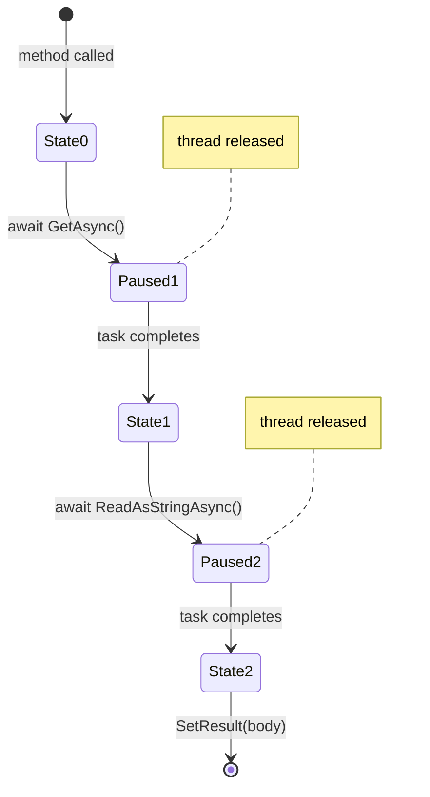

## What the Compiler Does Before Your Code Runs

In the [previous part](/series/async-await/what-is-async-await-csharp/), we established the core problem - threads standing idle during I/O - and introduced `async`/`await` as the mechanism that fixes it. But knowing what async does isn't the same as understanding how. The "how" starts with a transformation you never see.

When the C# compiler encounters a method marked `async`, it doesn't just compile it - it rewrites it entirely. The output is a state machine: a generated struct that can pause mid-execution, remember everything about where it stopped, and resume exactly there when the signal arrives. This is not runtime magic. It's a compile-time translation. `async` and `await` are essentially a developer-friendly notation for hand-writing that struct yourself, except the compiler is far more reliable at it than any of us would be.

> **Key Takeaways**
>
> - `async` enables `await` and triggers a compile-time transformation - it does not, by itself, make code run asynchronously.
> - `await` is a potential suspension point: if the awaited task isn't complete, the method pauses and the thread is released.
> - The compiler generates a state machine that resumes the method at each `await` point with all locals intact.
> - In UI apps, continuations return to the original `SynchronizationContext` (the UI thread); in ASP.NET Core, they run on a thread-pool thread.
> - If the awaited operation completes synchronously, `await` skips the suspension entirely - no allocation, no context switch.

## What `async` and `await` Actually Mean

The keyword `async` has exactly two effects: it permits `await` to appear inside the method, and it directs the compiler to transform that method into a state machine. Without an `await` inside, an `async` method runs synchronously and returns a completed `Task` - adding overhead for no benefit. The compiler will warn you about this with `CS1998`.

`await` is where the real behavior lives. When the compiler encounters `await someTask`, it generates code that checks: is this task already complete? If yes, continue without suspending. If no, register a continuation (what to run when the task completes), save the current state (local variables, execution position, synchronization context), and release the thread to its caller.

```csharp
// What you write:
async Task<string> FetchAsync(string url)
{
    using var http = new HttpClient();
    var response = await http.GetAsync(url);                    // suspension point 1
    var body     = await response.Content.ReadAsStringAsync();  // suspension point 2
    return body;
}
```

This looks sequential. After the compiler's transformation, it becomes a state machine with numbered states - state 0 (start), state 1 (after first await), state 2 (after second await) - each encoding the method's position and the values of local variables. When a task completes, the continuation moves the machine to the next state and resumes (Figure 1).

**State machine transitions — two await points in FetchAsync:**



### A look inside the state machine

A simplified version of what the compiler generates looks like this - you'd never write this by hand, but seeing it makes the cost model concrete:

```csharp
// Conceptual (actual compiler output is more complex and lower-level):
private struct FetchAsyncStateMachine : IAsyncStateMachine
{
    public int _state;
    public AsyncTaskMethodBuilder<string> _builder;
    private HttpClient _http;
    private HttpResponseMessage _response;
    private TaskAwaiter<HttpResponseMessage> _awaiter1;
    private TaskAwaiter<string> _awaiter2;

    public void MoveNext()
    {
        switch (_state)
        {
            case 0:
                _http = new HttpClient();
                var task1 = _http.GetAsync(url);
                _awaiter1 = task1.GetAwaiter();
                if (!_awaiter1.IsCompleted)
                {
                    _state = 1;
                    _builder.AwaitUnsafeOnCompleted(ref _awaiter1, ref this);
                    return; // suspend - release the thread
                }
                goto case 1;

            case 1:
                _response = _awaiter1.GetResult();
                var task2 = _response.Content.ReadAsStringAsync();
                _awaiter2 = task2.GetAwaiter();
                if (!_awaiter2.IsCompleted)
                {
                    _state = 2;
                    _builder.AwaitUnsafeOnCompleted(ref _awaiter2, ref this);
                    return; // suspend again
                }
                goto case 2;

            case 2:
                _builder.SetResult(_awaiter2.GetResult());
                return;
        }
    }
}
```

Each `return` is a real thread release. The thread walks away; the state machine waits as a struct on the heap, holding only the data it needs to resume. When the task completes, `MoveNext` is called again with the state integer pointing to the right case.

When the awaited operation completes synchronously - because the result was already available - the `IsCompleted` check in `MoveNext` short-circuits the suspension. No allocation happens for the continuation, no context switch occurs. This is the fast path that `ValueTask` is specifically designed to optimize: avoiding the heap allocation when a method frequently completes without ever suspending.

## What Gets Returned: `Task`, `ValueTask`, and Friends

Async methods are defined partly by what they return to their callers. The common types and when to use each:

| Return type | Use when |
| --- | --- |
| `Task` | The operation completes eventually, with no return value |
| `Task<T>` | The operation completes with a result of type `T` |
| `ValueTask` / `ValueTask<T>` | The operation frequently completes synchronously (cache hits, pre-computed values); avoids heap allocation. Use only after profiling - misuse creates subtle correctness bugs |
| `IAsyncEnumerable<T>` | Results arrive incrementally, consumed with `await foreach` |
| `void` | Event handlers only - callers can't await it, and exceptions can't be caught by callers |

`Task<T>` is the safe default for most async methods. Choose `ValueTask<T>` only when you have measurement showing the allocation is a bottleneck - typically in hot paths where the method completes synchronously more often than not.

### Passing a CancellationToken

A complete async method signature also accepts a `CancellationToken`. It's a cooperative signal: the caller triggers cancellation, and your method passes the token to every async API it calls. Those APIs throw `OperationCanceledException` when cancelled. Treat that as an expected outcome, not a failure.

```csharp
public async Task<string> FetchAsync(
    string url,
    CancellationToken cancellationToken = default)
{
    using var http = new HttpClient();
    var response = await http.GetAsync(url, cancellationToken);
    return await response.Content.ReadAsStringAsync(cancellationToken);
}
```

We cover cancellation and exception handling in depth in [part 6](/series/async-await/async-exception-handling-csharp/). For a full reference on async return types and when to reach for each one, see Microsoft's [Task-based Asynchronous Pattern documentation](https://learn.microsoft.com/en-us/dotnet/standard/asynchronous-programming-patterns/task-based-asynchronous-pattern-tap).

## Where the Continuation Runs

When an awaited task completes, the state machine resumes - but on which thread? The answer depends on the `SynchronizationContext` that was current when `await` was called.

In a WPF or WinForms app, there is a UI `SynchronizationContext`. Continuations posted to it run on the UI thread - making it safe to update UI elements after the `await` without explicit marshaling.

In ASP.NET Core, there is no `SynchronizationContext`. The framework was designed for the thread pool from the start, so continuations run on available thread-pool threads. This scales better and avoids unnecessary thread affinity.

`ConfigureAwait(false)` opts out of context capture explicitly:

```csharp
// Library code: run the continuation on whatever thread-pool thread is free
var json = await http.GetStringAsync(url).ConfigureAwait(false);
```

This avoids the overhead of posting back to a specific context. In library and service code, use it. In UI code where the continuation must access UI elements, don't. We'll go deeper on `SynchronizationContext` in [part 5](/series/async-await/async-continuations-synchronizationcontext/).

## Putting It Together

`async` and `await` are a compiler feature, not a runtime one. They let you write sequential-looking code that pauses cooperatively instead of blocking. The state machine handles the bookkeeping: saving locals, tracking position, and registering continuations. The `SynchronizationContext` handles where the method resumes.

Understanding this mechanism changes how you reason about async code - not as magic, but as a well-defined system with clear rules, predictable costs, and a few genuine constraints.

In [the next part](/series/async-await/async-await-throughput-responsiveness/), we'll look at what this mechanism actually buys you in the real world - why async code handles server load better, how it keeps UIs alive, and what happens when you block on a task instead of awaiting it.
