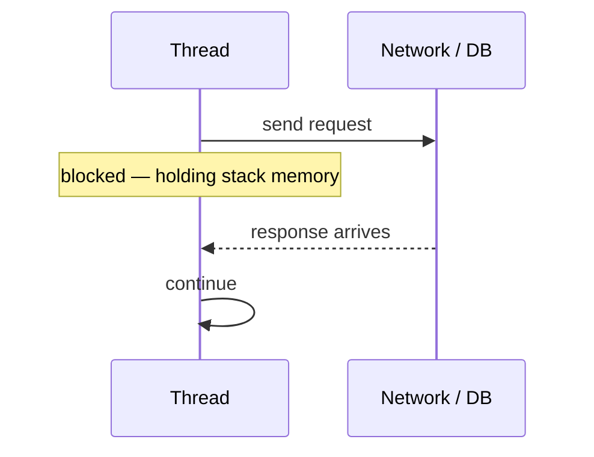
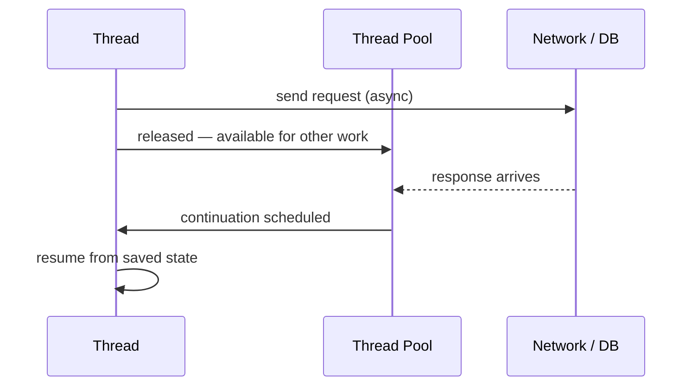
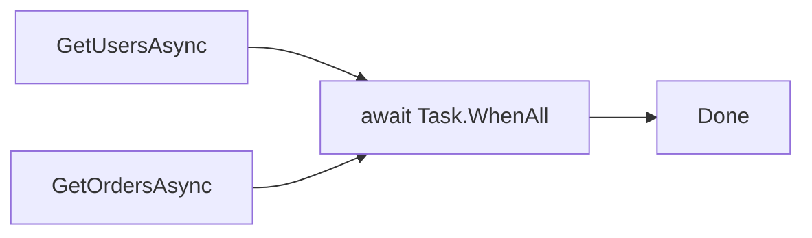

## What Are We Actually Solving?

Imagine three workers in a kitchen. One is washing dishes, another is chopping vegetables, and the third is standing at the stove, watching a pot that hasn't started boiling yet. None of them are idle in the traditional sense - but that third worker is frozen in place, waiting on something entirely outside their control. The other two can't get a clean pan. Orders are backing up. The kitchen is staffed, but the work is stalled.

In software, a thread is that worker. And for most of computing history, threads would freeze the same way - blocking on a network call, a database query, or a file read that hadn't returned yet. The CPU wasn't busy. The program wasn't thinking. It was just waiting on time.

That's the problem async programming solves. Not slowness. Waste.

> **Key Takeaways**
>
> - `async`/`await` is about freeing threads during I/O waits, not making code run faster.
> - The `async` keyword enables `await` and triggers a compile-time transformation into a state machine.
> - `await` releases the current thread while an operation is in flight, then resumes exactly where it paused.
> - For CPU-bound work, use `Task.Run` - async alone doesn't parallelize computation.
> - Sequential `await` calls run in order; start multiple tasks before awaiting them to run concurrently.

## Why Blocking Is the Wrong Answer

Software used to treat waiting as work. A thread would sit blocked on an I/O call, holding stack memory, unable to help with anything else. In a desktop app, that left the UI frozen - the window wouldn't repaint, mouse clicks wouldn't respond, and users assumed the app had crashed. In a web server, it meant every in-flight request consumed a thread regardless of whether that thread was doing anything useful.

The bottleneck wasn't compute power. It was patience, or the lack of it.

When you've debugged a UI that hangs during a data fetch - the spinning cursor, the frozen window - the code isn't broken. It's just standing still when it should be stepping aside. The thread is staffed; it just isn't working.

Async programming makes waiting cooperative. Instead of a thread blocking until an operation completes, the async model lets it say: "I've started this I/O request, and I'll come back when it's done. Use me for something else until then." The thread is returned to the pool. Other requests get served. When the result arrives, a continuation picks up a free thread and resumes the method from exactly where it paused, as shown in Figures 1 and 2.

**Blocking — thread held for the entire wait:**



**Async — thread released, resumes on completion:**



## What `async` and `await` Actually Do

The keyword `async` has exactly two practical effects: it allows the `await` operator to appear inside the method body, and it tells the compiler to transform that method into a state machine. That's it. Without an `await` inside, an `async` method runs synchronously, returns a completed `Task`, and adds overhead with no benefit.

`await` is where the actual behavior lives. When the compiler encounters `await someTask`, it generates code that checks: is the task already complete? If yes, the method continues without suspending - no context switch, no overhead. If no, the state machine saves everything (local variables, current position, captured context) and releases the thread back to its caller. When the task finishes, a continuation schedules the method to resume from the saved position.

```csharp
// Without async: the thread blocks here until the response arrives
var response = httpClient.GetAsync(url).Result;

// With async: the thread is released while the request is in flight
var response = await httpClient.GetAsync(url);
```

The method pauses. The thread doesn't wait. It's returned to the pool and can handle other work - other requests, UI events, whatever comes next. When the response arrives, the state machine grabs a free thread and continues.

The compiler's transformation is more literal than most developers expect. An `async` method becomes a private struct implementing `IAsyncStateMachine`, with each `await` becoming a numbered state. Every local variable becomes a field on that struct. The `MoveNext()` method - called when a continuation is scheduled - acts as a switch driven by a state integer, jumping to the right position in the original code flow.

### What async doesn't do

`async` doesn't make code concurrent by default. Sequential `await` calls still run in order - each one must complete before the next begins.

```csharp
// These run one after the other - combined wait equals the sum of all three
var users  = await GetUsersAsync();
var orders = await GetOrdersAsync();
```

To run them concurrently, start both before awaiting either:

```csharp
// Both I/O operations start immediately; wait for both to finish
var usersTask  = GetUsersAsync();
var ordersTask = GetOrdersAsync();

var users  = await usersTask;
var orders = await ordersTask;

// Or use Task.WhenAll for cleaner composition:
await Task.WhenAll(usersTask, ordersTask);
```

`async` also doesn't help with CPU-bound work. If your method is performing heavy computation - parsing large datasets, generating a PDF, running an algorithm - releasing the thread during that work doesn't help, because the work actively needs the CPU. For CPU-bound scenarios, use `Task.Run` to move work to a thread-pool thread, then `await` the result.

```csharp
// CPU-bound: move heavy computation off the calling thread
var result = await Task.Run(() => ProcessLargeDataset(input));
```

**Sequential awaits — each call waits for the previous one to finish:**


**Concurrent I/O — both start immediately, await completes when both are done:**



**CPU-bound work — offload to thread pool with Task.Run, then await the result:**


## The Shape of This Series

`async` and `await` look like two small keywords. But they rest on a structure with real depth - state machines, synchronization contexts, continuations, exception handling, and design conventions that separate code that works from code that scales well under pressure.

This series traces each layer:

- How the compiler rewrites async methods into state machines ([part 2](/series/async-await/how-async-await-works-csharp/))
- Why async improves throughput and responsiveness, and why `.Result` burns you ([part 3](/series/async-await/async-await-throughput-responsiveness/))
- The difference between asynchronous and parallel programming ([part 4](/series/async-await/async-vs-parallel-csharp/))
- How continuations work and what `ConfigureAwait(false)` actually prevents ([part 5](/series/async-await/async-continuations-synchronizationcontext/))
- How exceptions travel through async methods and where they surface ([part 6](/series/async-await/async-exception-handling-csharp/))
- How to design async methods that are reliable, honest about failure, and composable ([part 7](/series/async-await/designing-reliable-async-methods-csharp/))
- The habits that keep async code calm and correct over time ([part 8](/series/async-await/async-best-practices-csharp/))

In [the next part](/series/async-await/how-async-await-works-csharp/), we'll open the state machine — the compile-time structure that makes async methods actually work — and look at what the compiler actually generates when you write `async Task FetchAsync()`.

**Further reading:** [Task-based Asynchronous Pattern (TAP)](https://learn.microsoft.com/en-us/dotnet/standard/asynchronous-programming-patterns/task-based-asynchronous-pattern-tap) — Microsoft Learn.
