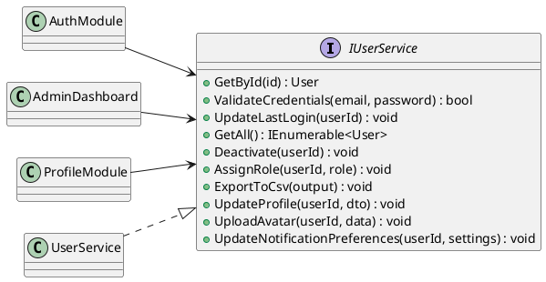
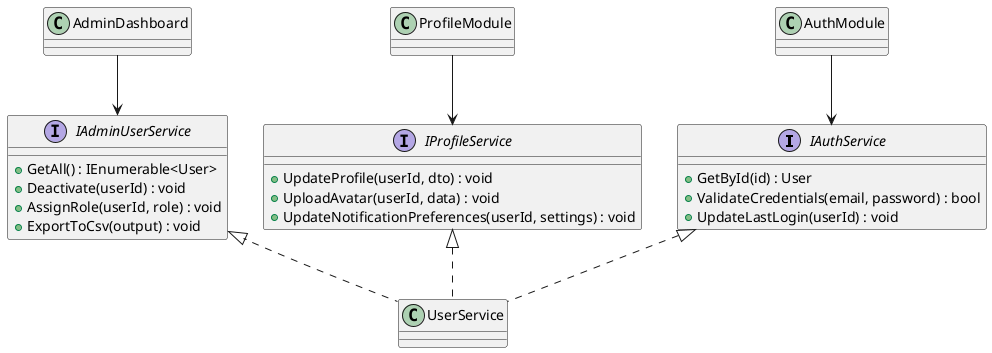
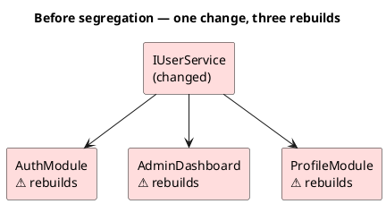
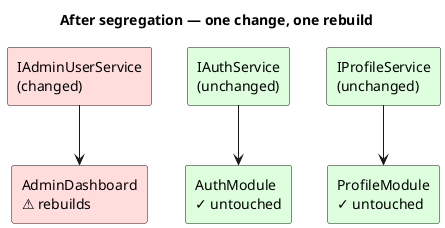
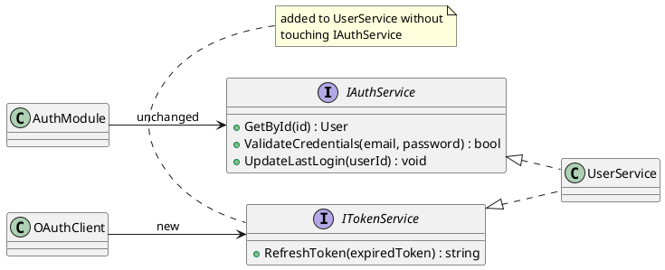
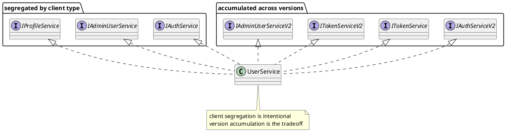

{: .prerequisites }
> Before reading, make sure you're comfortable with:
>
> - **Interfaces** — defining a contract that a class must fulfill. You should know what it means to declare an interface and implement it.
> - **Coupling** — the degree to which one module depends on another. Tight coupling means a change in one place forces changes elsewhere.
> - **Multiple interface implementation** — a single class implementing more than one interface at once. You should know this is valid and common.

ISP is the **I** in [SOLID](/series/solid-principles/) — one of five design principles for writing maintainable object-oriented software.

* TOC
{:toc}

## The Interface Segregation Principle

Robert C. Martin was consulting at Xerox on a new printer system. The software had grown around a single `Job` class that handled everything: printing, stapling, faxing, scheduling. Every subsystem depended on it. A stapling job knew about all the print methods. A print job knew about all the stapling methods. None of them needed that knowledge, but the single shared class made it unavoidable.

The consequence: any change, no matter how small, triggered a full redeployment of the entire system, a cycle that took an hour. A one-line fix in the stapling logic meant an hour of waiting before you could verify anything worked. Development had nearly ground to a halt.

The root cause was that each subsystem was forced to depend on a contract far larger than what it actually needed. Martin published his analysis in [*The Interface Segregation Principle*](https://en.wikipedia.org/wiki/Interface_segregation_principle) (1996) and later in *Agile Software Development: Principles, Patterns, and Practices* (2002):[^1]

> "Clients should not be forced to depend upon interfaces that they do not use."
> <cite>Robert C. Martin</cite>

Meaning — don't force a class to know about methods it will never call.

The word *client* here doesn't mean an end user. A **client** is anything that consumes a service through an interface — a class, a module in a separate assembly, or an entirely different application. What makes something a client is its role: it depends on the contract rather than implementing it.

## What Makes a Fat Interface Expensive?

{: .info }
A **fat interface** is an interface that has grown to include methods not all of its clients need. Every class that implements it must account for the full contract, and every class that depends on it recompiles whenever any part of it changes — even the parts it never uses.

Imagine a `IUserService` that has accumulated responsibilities over time. Authentication, admin management, and profile editing all ended up in the same interface:

```csharp
interface IUserService
{
    // Used by the auth module
    User GetById(int id);
    bool ValidateCredentials(string email, string password);
    void UpdateLastLogin(int userId);

    // Used by the admin dashboard
    IEnumerable<User> GetAll();
    void Deactivate(int userId);
    void AssignRole(int userId, string role);
    void ExportToCsv(Stream output);

    // Used by the profile module
    void UpdateProfile(int userId, ProfileDto dto);
    void UploadAvatar(int userId, byte[] imageData);
    void UpdateNotificationPreferences(int userId, NotificationSettings settings);
}
```

Three clients, all depending on `IUserService`:

```csharp
class AuthModule
{
    private readonly IUserService _users;

    public AuthModule(IUserService users) => _users = users;

    public bool Login(string email, string password)
    {
        var user = _users.GetById(...);
        if (_users.ValidateCredentials(email, password))
        {
            _users.UpdateLastLogin(user.Id);
            return true;
        }
        return false;
    }
}
```

`AuthModule` calls three methods, but depends on all ten. When `ExportToCsv` changes its signature, `AuthModule` must be recompiled and redeployed, even though it never called that method. In C#, every assembly that references a changed interface must be rebuilt regardless of which methods it uses.[^3] The more clients share a fat interface, the more assemblies get dragged into every rebuild.



## Segregating the Interface

Break `IUserService` into interfaces that match what each client actually needs:

```csharp
interface IAuthService
{
    User GetById(int id);
    bool ValidateCredentials(string email, string password);
    void UpdateLastLogin(int userId);
}

interface IAdminUserService
{
    IEnumerable<User> GetAll();
    void Deactivate(int userId);
    void AssignRole(int userId, string role);
    void ExportToCsv(Stream output);
}

interface IProfileService
{
    void UpdateProfile(int userId, ProfileDto dto);
    void UploadAvatar(int userId, byte[] imageData);
    void UpdateNotificationPreferences(int userId, NotificationSettings settings);
}
```

`UserService` implements all three. The implementation doesn't change. What changes is the contract each client sees:

```csharp
class UserService : IAuthService, IAdminUserService, IProfileService
{
    // full implementation unchanged
}
```

```csharp
class AuthModule
{
    private readonly IAuthService _auth; // depends on 3 methods, not 10
    ...
}
```

`ExportToCsv` can now change freely. `AuthModule` doesn't reference `IAdminUserService` and has no reason to recompile.



{: .important }
Design interfaces around what clients need, not around what the service can do. An interface sized to its client has one reason to change: the same reason the client has.[^2]

### Why This Stops the Recompilation Cascade

Take the `ExportToCsv` change from earlier, where the signature needs a new `ExportFormat` parameter:

```csharp
// IAdminUserService — signature changed
void ExportToCsv(Stream output, ExportFormat format);
```

**Before segregation**, all three projects reference `IUserService`. The build system sees `IUserService` changed and flags every assembly that depends on it: `AuthModule`, `AdminDashboard`, and `ProfileModule` all recompile. In a CI/CD pipeline with independently deployable services, all three ship a new build for a change only one of them cares about.



**After segregation**, `AuthModule` references `IAuthService`. `ExportToCsv` is on `IAdminUserService`, which `AuthModule` never imported. The build system checks whether `AuthModule` references the changed interface, and it doesn't. `AuthModule` doesn't recompile, its tests don't re-run, and its deployed artifact stays untouched.



The isolation holds as long as the interfaces and their clients live in separate assemblies. If all three clients are compiled together in a single project, the boundary doesn't exist at the build level regardless of how the interfaces are split.

## One Interface Per Group of Clients

The split above was driven by three existing clients: auth, admin, and profile. That grouping wasn't arbitrary — each interface represents a distinct reason to call `UserService`. `IAuthService` exists because the auth module needs to verify identity. `IAdminUserService` exists because the dashboard needs to manage users. `IProfileService` exists because the profile module needs to edit personal data. Three different jobs, three different contracts.

ISP does not say *one interface per class that uses the service*. If the admin dashboard were two separate classes — say, a `UserListPage` and a `RoleManagementPage` — they'd both depend on `IAdminUserService`. The grouping is by what clients need in common, not by how many files happen to consume the service. Splitting `IAdminUserService` into two because two classes use it would produce interfaces that always appear together, which isn't segregation — it just moves the fat one level down.

The same logic covers shared methods. If `GetById` were needed by both auth and profile, it would appear in both `IAuthService` and `IProfileService`. That's fine. The repetition is honest — both clients actually need it, and neither should be forced to go through the other's interface to get it.

{: .important }
Segregate by **client type**, not by individual client. One interface per logical group, not one interface per class.

## What Happens When an Interface Needs to Change?

Splitting by client type keeps interfaces focused. But what if `UserService` itself needs a new capability — without forcing existing clients to recompile?

When an interface needs a new capability, the easy move is to add the method directly, forcing every client to recompile. The safer approach is to **add a new interface** rather than modify the existing one.

If a new OAuth flow needs `RefreshToken`, don't add it to `IAuthService`. Introduce `ITokenService`:

```csharp
interface ITokenService
{
    string RefreshToken(string expiredToken);
}

class UserService : IAuthService, IAdminUserService, IProfileService, ITokenService
{
    public string RefreshToken(string expiredToken) { ... }
}

class OAuthClient
{
    private readonly ITokenService _tokens;

    public OAuthClient(ITokenService tokens) => _tokens = tokens;
}
```

`AuthModule`, `AdminDashboard`, and `ProfileModule` are untouched: they don't reference `ITokenService`.

`UserService` gains `ITokenService` without `IAuthService` changing. `AuthModule` has no path to `ITokenService` — from its perspective, the capability doesn't exist.



### The Tradeoff

A class that accumulates interfaces across features and versions can end up with dozens. At some point `IAuthServiceV2`, `ITokenServiceV2`, and `IAdminUserServiceV2` add more confusion than value, and updating all callers is the cleaner path. Use additive interfaces when backward compatibility is genuinely required: public APIs and shared libraries. For internal code where you control all callers, modifying the interface directly is usually right.



## Where Fat Interfaces Break Down

ISP violations don't show up as compiler errors. They build up as interfaces grow, and the effects aren't always obvious.

The visible symptom is a recompilation cascade. You change one method and a list of unrelated assemblies needs to be rebuilt. You trace back why `AuthModule` is flagged: it references `IUserService`. You only changed `ExportToCsv`. `AuthModule` doesn't use `ExportToCsv`. But it can't avoid knowing about it.

The less visible symptom shows up in tests. When you mock `IUserService` for an `AuthModule` unit test, you're dealing with a ten-method interface when only three of those methods matter to the module under test. With a strict mock, you must set up all ten or it throws. With a loose mock, the other seven silently return defaults — and nothing stops you from asserting on them by mistake. After segregation, mocking `IAuthService` gives you exactly three methods. The interface tells you what `AuthModule` depends on without reading a single line of its code.

The worst case is when clients start implementing stub methods to satisfy a contract they can't fully honour. Take `ExternalAuthAdapter`, a third-party integration that only handles authentication. It implements `IUserService` because that's the only contract available:

```csharp
class ExternalAuthAdapter : IUserService
{
    // The three methods this adapter actually supports
    public User GetById(int id) { ... }
    public bool ValidateCredentials(string email, string password) { ... }
    public void UpdateLastLogin(int userId) { ... }

    // The interface demands these — the adapter has no use for them
    public IEnumerable<User> GetAll() => throw new NotImplementedException();
    public void Deactivate(int userId) => throw new NotImplementedException();
    public void AssignRole(int userId, string role) => throw new NotImplementedException();
    public void ExportToCsv(Stream output) => throw new NotImplementedException();
    public void UpdateProfile(int userId, ProfileDto dto) => throw new NotImplementedException();
    public void UploadAvatar(int userId, byte[] imageData) => throw new NotImplementedException();
    public void UpdateNotificationPreferences(int userId, NotificationSettings settings) => throw new NotImplementedException();
}
```

The compiler is satisfied. The contract is hollow. Any caller that passes an `ExternalAuthAdapter` where a full `IUserService` is expected will hit a `NotImplementedException` the moment it calls a method the adapter doesn't support, which is the exact failure mode that [LSP](/series/solid-principles/liskov-substitution-principle/) describes. The LSP fix in that post, splitting `IChargeable` and `IRefundable`, was ISP in action. ISP would have prevented the bad hierarchy from forming in the first place.

Fat interfaces also undermine the abstractions that [DIP](/series/solid-principles/dependency-inversion-principle/) depends on. A wide interface carries too many concerns to stay stable. Every new client need is a potential change to the contract, and every contract change ripples to every client. Narrow interfaces hold their shape.

## When Should You Actually Segregate?

ISP doesn't mean every interface should have exactly one method, or that a shared contract is wrong. The question is always the same: do all of the clients of this interface actually need all of its methods?

When the answer is yes — every client calls every method — there's nothing to segregate. The interface is already a natural fit for its consumers. Splitting it adds indirection without a meaningful boundary.

When the answer is no, ISP applies. The visible signal is usually one of the failure modes from above: a recompilation cascade when a change touches modules that don't care about it, bloated mock setup in tests where only a fraction of the interface matters, or stub methods that throw `NotImplementedException` to satisfy a contract the class can't fully honour.

The risk on the other side is mechanical splitting — dividing interfaces at the method level regardless of whether the boundaries reflect real differences between clients. Two methods that every caller always uses together aren't a fat interface. They're a cohesive unit. Splitting them produces interfaces that always appear side by side, which isn't segregation — it's fragmentation.

The useful question isn't "how many methods does this interface have?" A large interface isn't automatically a fat one. It's "does every client of this interface need every method on it?" When a client must depend on methods it will never call, the interface has grown past what that client's relationship to the service actually requires. That's the line ISP asks you to draw.

Apply ISP where clients need different subsets of a service's capabilities. Skip it where splitting would produce interfaces that always travel together.

[^1]: Robert C. Martin, [The Interface Segregation Principle](https://web.archive.org/web/20150905081111/http://www.objectmentor.com/resources/articles/isp.pdf), *The C++ Report* (1996)
[^2]: Robert C. Martin, *Agile Software Development: Principles, Patterns, and Practices* (2002), Ch. 12
[^3]: C# language specification: a referencing assembly must be recompiled whenever a referenced assembly's public surface changes, including interface method signatures. See [Microsoft docs: assemblies and the compilation model](https://learn.microsoft.com/en-us/dotnet/standard/assembly/)
