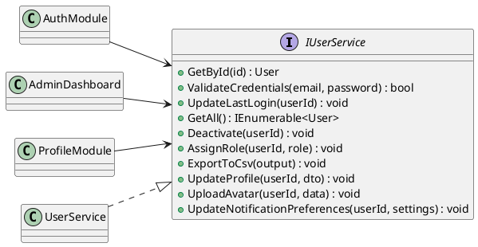
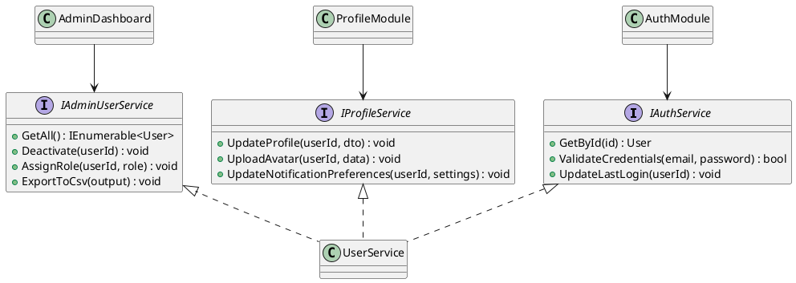
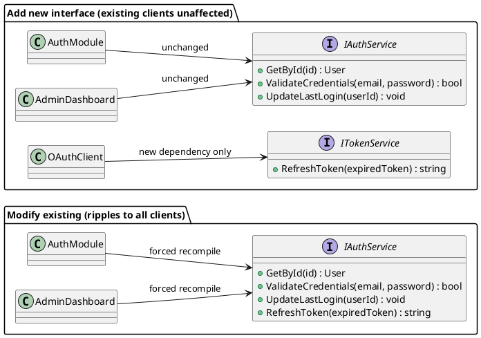
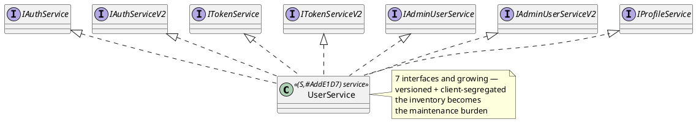
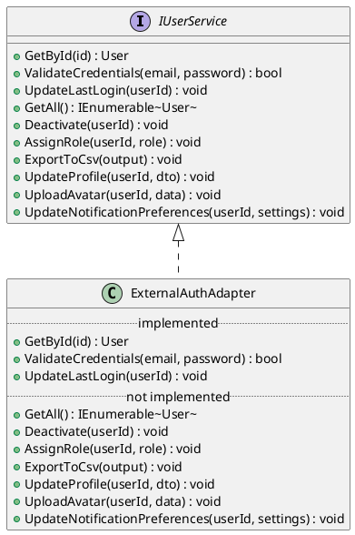

{: .prerequisites }
> Before reading, make sure you're comfortable with:
>
> - **Interfaces** — defining a contract that a class must fulfill. You should know what it means to declare an interface and implement it.
> - **Coupling** — the degree to which one module depends on another. Tight coupling means a change in one place forces changes elsewhere.
> - **Multiple interface implementation** — a single class implementing more than one interface at once. You should know this is valid and common.

ISP is the **I** in [SOLID](/series/solid-principles/) — one of five design principles for writing maintainable object-oriented software.

## The Interface Segregation Principle

Robert C. Martin introduced ISP in his 1996 paper *The Interface Segregation Principle* and developed it in *Agile Software Development: Principles, Patterns, and Practices* (2002):

> "Clients should not be forced to depend upon interfaces that they do not use."
> <cite>Robert C. Martin</cite>

The word *client* here doesn't mean an end user. A **client** is any class that depends on a service through its interface — it holds a reference and calls methods on it. The service *implements* the interface; the client *uses* it. In the example below, `AuthModule` is a client of `IUserService`. It receives the interface via constructor injection and calls methods on it. It never implements `IUserService`.

The principle came from a real problem. Martin was consulting at Xerox on a printer system where a single `Job` class handled everything — printing, stapling, status reporting, scheduling. Every client depended on it through one shared interface. Whenever any method changed, every client had to be rebuilt — including those that never called the changed method.

## When a Fat Interface Gets Expensive

Imagine a `IUserService` that has accumulated responsibilities over time. Authentication, admin management, and profile editing all ended up in the same interface:

```csharp
interface IUserService
{
    // Used by the auth module
    User GetById(int id);
    bool ValidateCredentials(string email, string password);
    void UpdateLastLogin(int userId);

    // Used by the admin dashboard
    IEnumerable<User> GetAll();
    void Deactivate(int userId);
    void AssignRole(int userId, string role);
    void ExportToCsv(Stream output);

    // Used by the profile module
    void UpdateProfile(int userId, ProfileDto dto);
    void UploadAvatar(int userId, byte[] imageData);
    void UpdateNotificationPreferences(int userId, NotificationSettings settings);
}
```

Three clients, all depending on `IUserService`:

```csharp
class AuthModule
{
    private readonly IUserService _users;

    public AuthModule(IUserService users) => _users = users;

    public bool Login(string email, string password)
    {
        var user = _users.GetById(...);
        if (_users.ValidateCredentials(email, password))
        {
            _users.UpdateLastLogin(user.Id);
            return true;
        }
        return false;
    }
}
```

`AuthModule` calls three methods, but depends on all ten. When `ExportToCsv` changes its signature, `AuthModule` must be recompiled and redeployed — even though it never called that method. In C#, every assembly that references a changed interface must be rebuilt regardless of which methods it uses. The more clients share a fat interface, the wider the blast radius of any change.



## Segregating the Interface

Break `IUserService` into interfaces that match what each client actually needs:

```csharp
interface IAuthService
{
    User GetById(int id);
    bool ValidateCredentials(string email, string password);
    void UpdateLastLogin(int userId);
}

interface IAdminUserService
{
    IEnumerable<User> GetAll();
    void Deactivate(int userId);
    void AssignRole(int userId, string role);
    void ExportToCsv(Stream output);
}

interface IProfileService
{
    void UpdateProfile(int userId, ProfileDto dto);
    void UploadAvatar(int userId, byte[] imageData);
    void UpdateNotificationPreferences(int userId, NotificationSettings settings);
}
```

`UserService` implements all three — nothing in the implementation changes. What changes is the contract each client sees:

```csharp
class UserService : IAuthService, IAdminUserService, IProfileService
{
    // full implementation unchanged
}
```

```csharp
class AuthModule
{
    private readonly IAuthService _auth; // depends on 3 methods, not 10
    ...
}
```



`ExportToCsv` can now change freely — `AuthModule` doesn't reference `IAdminUserService` and has no reason to recompile.

### Is the Isolation Complete?

ISP gives you **interface-level isolation**: a client that doesn't reference an interface is unaffected by changes to it. But it's not unconditional.

If `UserService` changes a method that *is* in `IAuthService`, `AuthModule` is still affected — correctly, because it depends on that method. If `UserService` and all three clients live in the same compiled assembly, they'll all recompile together regardless of interface boundaries.

The isolation ISP provides is an isolation of *contract*, not *implementation*. The full payoff comes when the interfaces and their clients live in separate assemblies — which is where ISP naturally leads.

## Segregate by Type, Not by Class

ISP does not say *one interface per class that uses the service*. That would make `UserService` inherit from every individual caller — a dependency graph that runs backwards.

Group clients by **type**, and create one interface per type. Desktop clients get one interface. Web clients get another. If two client types need the same method, it appears in both — that's fine.

```csharp
interface IDesktopUserService
{
    User GetById(int id);
    void UpdateProfile(int userId, ProfileDto dto);
    void UploadAvatar(int userId, byte[] imageData);
}

interface IWebUserService
{
    User GetById(int id);
    void UpdateProfile(int userId, ProfileDto dto);
    // no direct avatar upload — handled via a separate upload endpoint
}
```

`GetById` and `UpdateProfile` appear in both. Each interface is still a minimal contract for its client type.

{: .important }
Segregate by **client type**, not by individual client. One interface per logical group, not one interface per class.

## When Interfaces Need to Change

When an interface needs a new capability, the tempting path is to add the method directly — forcing every client to recompile. The safer approach is to **add a new interface** rather than modify the existing one.

If a new OAuth flow needs `RefreshToken`, don't add it to `IAuthService`. Introduce `ITokenService`:

```csharp
interface ITokenService
{
    string RefreshToken(string expiredToken);
}

class UserService : IAuthService, IAdminUserService, IProfileService, ITokenService
{
    public string RefreshToken(string expiredToken) { ... }
}

class OAuthClient
{
    private readonly ITokenService _tokens;

    public OAuthClient(ITokenService tokens) => _tokens = tokens;
}
```

`AuthModule`, `AdminDashboard`, and `ProfileModule` are untouched — they don't reference `ITokenService`.

The diagram below contrasts the two approaches. Modifying `IAuthService` directly propagates the change to every client. Adding `ITokenService` leaves existing clients untouched.



### The Tradeoff

A class that accumulates interfaces across features and versions can end up with dozens. At some point `IUserServiceV4` adds more confusion than value, and updating all callers is the cleaner path. Use additive interfaces when backward compatibility is genuinely required — public APIs, shared libraries. For internal code where you control all callers, modifying the interface directly is usually right.



## The Cost of Getting It Wrong

ISP violations don't announce themselves. They accumulate quietly as interfaces grow, and the cost surfaces in indirect ways.

The visible symptom is a recompilation cascade. You change one method and a list of unrelated assemblies needs to be rebuilt. You trace back why `AuthModule` is flagged — it references `IUserService`. You only changed `ExportToCsv`. `AuthModule` doesn't use `ExportToCsv`. But it can't avoid knowing about it.

The less visible symptom shows up in tests. A unit test for `AuthModule` needs a mock of `IUserService` — all ten methods, even though the test only exercises three. Test setup grows. The mock becomes a maintenance burden. Nobody remembers which methods actually matter for a given test, because the interface itself doesn't tell you.

The most dangerous form is when clients start implementing stub methods. Imagine an `ExternalAuthAdapter` — a third-party integration that only handles authentication. It implements `IUserService` because that's the only contract available, but most of it doesn't apply:

```csharp
class ExternalAuthAdapter : IUserService
{
    // The three methods this adapter actually supports
    public User GetById(int id) { ... }
    public bool ValidateCredentials(string email, string password) { ... }
    public void UpdateLastLogin(int userId) { ... }

    // The interface demands these — the adapter has no use for them
    public IEnumerable<User> GetAll() => throw new NotImplementedException();
    public void Deactivate(int userId) => throw new NotImplementedException();
    public void AssignRole(int userId, string role) => throw new NotImplementedException();
    public void ExportToCsv(Stream output) => throw new NotImplementedException();
    public void UpdateProfile(int userId, ProfileDto dto) => throw new NotImplementedException();
    public void UploadAvatar(int userId, byte[] imageData) => throw new NotImplementedException();
    public void UpdateNotificationPreferences(int userId, NotificationSettings settings) => throw new NotImplementedException();
}
```

The compiler is satisfied. The contract is hollow. Any caller that passes an `ExternalAuthAdapter` where a full `IUserService` is expected will hit a `NotImplementedException` the moment it calls a method the adapter doesn't support — the exact failure mode that [LSP](/series/solid-principles/liskov-substitution-principle/) describes. The LSP fix in that post — splitting `IChargeable` and `IRefundable` — was ISP in action. ISP would have prevented the bad hierarchy from forming in the first place.



This is the same failure mode as [LSP](/series/solid-principles/liskov-substitution-principle/) violations — in fact, the `GiftCardProcessor` fix from LSP was ISP in action. Splitting `IChargeable` and `IRefundable` meant `GiftCardProcessor` only had to implement what it could genuinely honor. ISP would have prevented the bad hierarchy from forming in the first place.

Fat interfaces are also a problem for the abstractions that [DIP](/series/solid-principles/dependency-inversion-principle/) depends on. A wide interface is a fragile abstraction — it carries too many concerns to stay stable. Every new client need is a potential change to the contract, and every contract change ripples to every client. ISP keeps abstractions narrow enough that they can be stable.

Design interfaces around what clients need, not around what the service can do. An interface sized to its client has one reason to change — the same reason the client has to change.[^1][^2]

[^1]: Robert C. Martin, [The Interface Segregation Principle](https://web.archive.org/web/20150905081111/http://www.objectmentor.com/resources/articles/isp.pdf), *The C++ Report* (1996)
[^2]: Robert C. Martin, *Agile Software Development: Principles, Patterns, and Practices* (2002), Ch. 12
