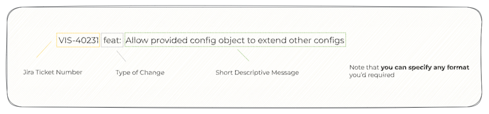
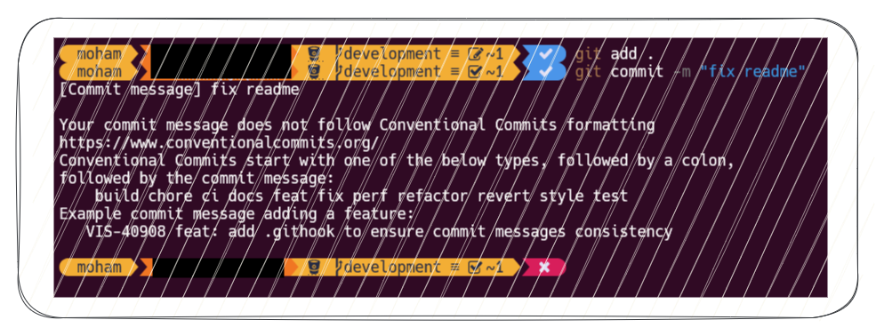

Commit messages are an essential part of version control systems, providing a historical overview of a project's changes. <!--more--> However, poorly written commit messages can cause headaches for developers trying to understand past changes, leading to wasted time and effort. In this article, we'll explore the art of writing good commit messages and why it's important to enforce or validate them. We'll also introduce Conventional Commits, a specification designed to achieve consistent, automated, and validated commit messages, and show how to validate commit messages using the commit-msg git hook.

## Why Commit Messages are such a big deal?

Version Control Systems were invented with the backway mechanism in mind, that’s represented By:
- Commit ID e.g. 6e24e45
- Commit Message e.g., fix a bug (please don’t do this)
- A State (after a change)

As time passes by, you eventually have to take a look at some changes that were made in the past. either you want to find out When a bugfix was introduced or who made a specific change and It should all be ready for the take when looking at the commit history.

## The Art of Writing a Bad Commit

To write a Bad Commit as a Pro, you’ll need to follow One Rule:

> A Bunch of empty words to bypass the basic validation of git "a commit message is required."\
> — <cite> A Lazy Developer </cite> 

### Examples

#### In Progress? Oh Really!

Oh, thanks for letting everyone know that (whatever happened there) is still in progress even though it’s 2022 Now! (next year will be still in progress too)

#### Code Changes! Obvious Enough

Thanks for your efforts. But we already know that it’s a commit. So, it has “CHANGES”. And What did you mean by 161?! Is it the police number? A ticket number? If so, Which board does it belong to? Is it even a Jira Board? What are the business rules behind this? Does the author still work here? Who did replace his position? In which team?

#### 3 Hours Later

> A Commit message that takes 3 minutes to read.\
> — <cite> A Developer with Literature Passioncite </cite>

A commit message that requires three minutes to read may suggest verbosity or unnecessary complexity. Ideally, messages should be concise, conveying essential information efficiently. Long-winded messages can be counterproductive, potentially hindering quick comprehension and slowing down the development workflow. Striving for brevity is key for effective communication in version control.

## What makes a Good Commit?

- Build a habit of making good commits (It takes time!)
- Keep your Commits Small
- Keep the changes staged within a commit related somehow!
- Write a meaningful & Descriptive message.
- If the changes are irrelevant. Then, it means a new commit is needed!

## What makes a Good Commit Message?

A Good Commit Message, Is the shortest readable and descriptive message that could provide anyone with all the significant references and information at any time.

- It has to be short, readable, and descriptive.
- It should mention significant references.

For example, A JIRA Ticket Number can provide anyone with:

- The User Story (Business Rules & Acceptance Criteria)
- The Team behind the change (maybe you can ask for their help later)
- Maybe technical documentation is mentioned somewhere there.
- Whoever tested this, so you can blame later for accepting your buggy work. (Never Do this)

## Why would I make a Good Commit?

So, you’re wondering why would I waste my time doing all of this?

Remember when you had a tricky bug caused by a change that was made by someone who resigned 3 years ago, and the only information or references you had at this moment was the name of the author and a bunch of non-related changes within the commit, even the commit message was called “Count the Stars”?

Did you “Count the Stars”? Or Spent hours and hours trying to

- investigate
- change
- run
- debug
- rollback
- investigate again, run, debug, … it’s the mid of the night already!

Congratulations! Now you can Count the Stars. Yet you still didn’t figure out the Root Cause of the Problem.
No one is wasting your time, you do! By not spending a little more time keeping your version control history consistent. Not only your time, time of others as well!

## Conventional Commits

If you do agree now that we need a “Good Commit”, here is the good news!

Conventional Commits were designed to achieve a Good Commit Message in a way that could be Automated, Validated, Read, or Written. also, it dovetails with Semantic Versioning.

The most important advantage of following such a specification is achieving a level of commit messages consistency between all teams:

- No one has his own Signature for the Commit message. 
- You don’t need to think about it twice!

## Main Structural Elements

- **fix**: a commit of the type fix patches a bug in your codebase (this correlates with PATCH in Semantic Versioning).
- **feat**: a commit of the type feat introduces a new feature to the codebase (this correlates with MINOR in Semantic Versioning).
- **BREAKING CHANGE**: a commit that's marked as BREAKING CHANGE: or appends after the type/scope, introduces a breaking API change (correlating with MAJOR in Semantic Versioning). A BREAKING CHANGE can be part of commits of any type.

### Example

## Why Use Conventional Commits

- Automatically generating CHANGELOGs.
- Automatically determining a semantic version bump (based on the types of commits landed).
- Communicating the nature of changes to teammates, the public, and other stakeholders.
- Making it easier for people to contribute to your projects, by allowing them to explore a more structured commit history.

## Validating The Commit Message

Now as we have a Standardized format for our messages shared across all teams, we can use the commit-msg git hook to validate the commit message based on a specific regular expression. So that, if the message does comply with our format it will pass. Otherwise, an error message will be returned to the user asking her/him to follow a certain format!

### Example

So, what happened is I did try to commit with the arbitrary message, that doesn’t comply with the git hook regular expression.
Then it stopped me! and Nothing has been committed!

## `commit-msg` Git hook

So, what the git-hook does is execute a script in predefined cases. and to validate our commit message, I've used the commit-msg git hook which was made for that purpose! read more. For honesty, I borrowed this script from someone on medium.com and did a few modifications to suit my case, I struggle now to reach his article. so if it does seem familiar to you, please mention his article in a comment!

## Summary

Git commits and messages serve as the project's historical backbone, demanding cleanliness, structure, and information. Avoid late-night deciphering of ancient code changes—maintain clarity. Enforce validation; vigilance is key in a landscape filled with careless contributors.